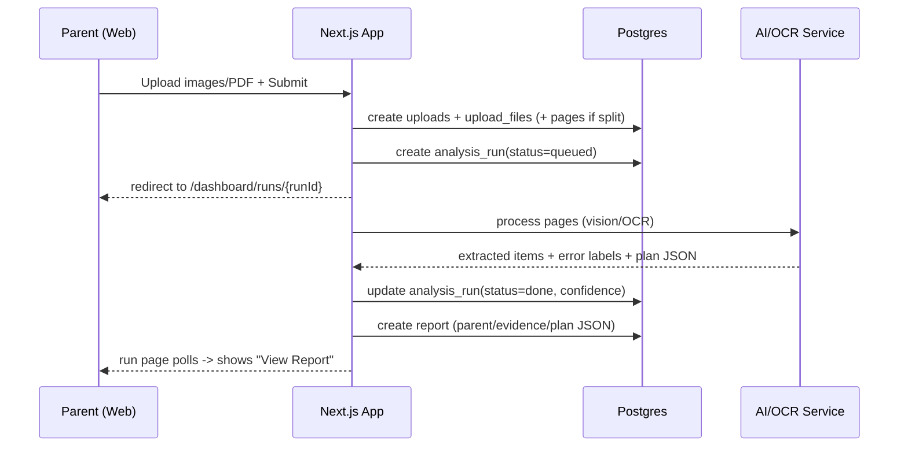
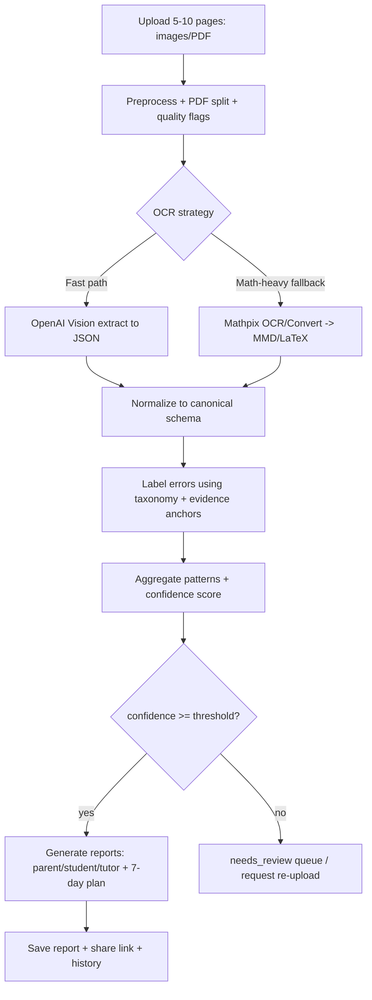
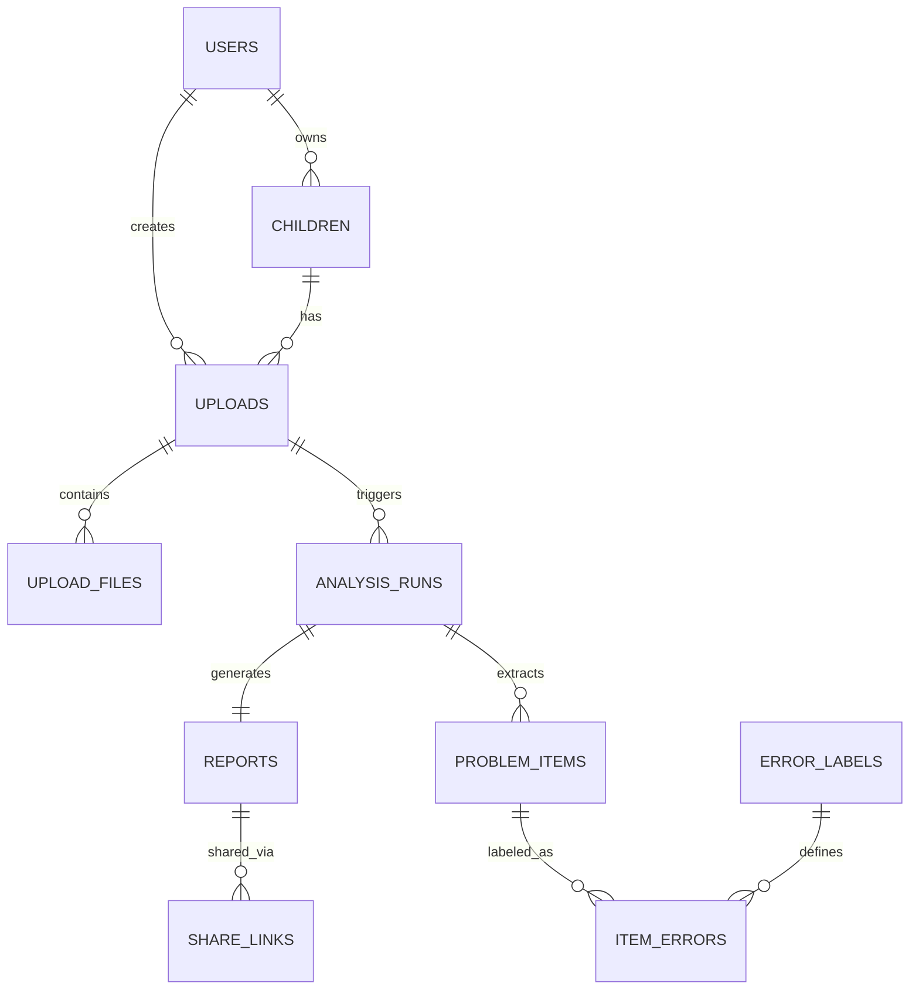
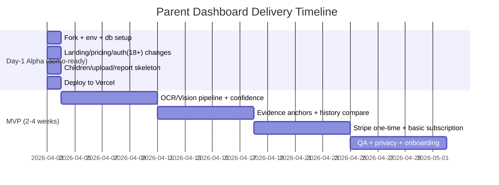

# 家长仪表盘 Parent Dashboard（欧美 Web MVP）PRD + nextjs/saas-starter 一天落地实施说明

## Executive Summary

本产品面向欧美家庭（优先美国/英语市场）的 Web MVP：**家长仪表盘（Parent Dashboard）**。家长上传孩子最近 **5–10 页**数学作业/测验/错题订正页（图片或 PDF），系统在数分钟内输出一份**可执行的 7 天学习诊断与行动计划**，并提供“证据链（Evidence）”可追溯到具体页/题目，同时支持**共享给 tutor**，并在下一次上传时做**周度复盘**（重复错误趋势与重点迁移）。这一定位聚焦家长与 tutor 的真实决策节点：考试后补救策略、是否需要 tutor、tutor 是否有效、下一周怎么安排。

该产品在欧美的“可接受入口”是 **parent-first**：由家长创建账户、上传材料、消费报告。这个模式与 **Khan Academy 的 Parent Dashboard/连接孩子账号**的家长入口一致（“Parent Dashboard + Add a child”是核心操作）。citeturn20search2turn20search6 也与 **Khanmigo** 的访问/年龄门槛模式一致：Khanmigo 明确要求要么用户本人满足年龄/订阅条件，要么由家长/监护人为未成年人开通。citeturn22search3turn22search1

产品价值主张不是“解题”，而是“诊断 + 下一步”。**IXL Diagnostic** 的价值表达非常接近：提供“清晰、最新的学习画像 + 个性化 next steps”。citeturn20search3turn20search15 本产品用“真实学习痕迹上传”替代“在线测评做题”，把家长的“翻作业焦虑”变成“本周可执行计划”。

技术实现采用“**多模态理解 + 结构化抽取 + 错因归类 + 计划生成 + 质量控制**”流水线：  
- OpenAI API 支持图片输入（URL/base64/file id，且可多图同请求）。citeturn0search1turn0search9turn23search6  
- Mathpix 适合手写数学/公式结构化输出，且 PDF OCR 常为异步处理（适合后台任务）。citeturn0search2turn0search10turn0search14  
- Google Cloud Vision OCR 支持手写识别（DOCUMENT_TEXT_DETECTION）并返回 page/block/paragraph/word 等结构。citeturn0search3turn0search15  
- 数据合规：OpenAI 平台默认会生成滥用监测日志并最多保留 30 天（除非法律要求更久）。citeturn20search1

**交付目标（MVP）**  
- 体验目标：家长首次上传→30 秒内看到“初步诊断摘要”，3–6 分钟内看到完整“Diagnosis/Evidence/7-Day Plan”。  
- 商业目标：单次诊断付费闭环可跑通（Stripe Checkout）。Stripe Checkout Sessions 明确支持一次性或订阅型支付。citeturn20search4turn20search0turn20search8  
- 工程目标：基于 **nextjs/saas-starter** 一天内改出可运行 Alpha（Landing + 注册登录 + Dashboard + Child + Upload + Report + Share），并能部署到 Vercel。该 starter 自带 marketing landing、pricing（连 Stripe Checkout）、dashboard、JWT cookie auth、全局中间件保护登录路由、Postgres+Drizzle。citeturn1view0turn18view0turn26view0  

产品一句话定位：  
**把孩子最近 5–10 页数学作业/测验/错题页，转成“有证据链的错因诊断 + 7 天行动计划 + 周度复盘”，让家长这周就能做对事。**

---

## 用户画像与付费理由

### 目标用户画像

**家长（Primary buyer）**  
- 8–15 岁孩子家长，尤其 4–8 年级数学。时间紧、不具备教学法，愿意付费换确定性。  
- 行为：考试后翻作业找错题、在网上搜讲解、买练习册、考虑请 tutor。  
- 购买动机：减少试错（乱刷题/乱买课/乱请 tutor）、获得可执行路径、方便和 tutor/老师沟通。

**Tutor（Secondary buyer / channel partner）**  
- 独立 tutor、小型 tutoring center。  
- 行为：课前 intake 看卷子、写周报、与家长沟通。  
- 付费动机：节省分析时间、标准化交付材料、提升续费/转介绍。

### 关键触发场景（最容易付费）

- **单元测/quiz/test 后 24–72 小时**：家长最焦虑、最需要判断“根因是什么”。  
- **准备请 tutor 之前**：想先诊断，避免浪费预算。  
- **已请 tutor 但效果不清楚**：需要可量化复盘（重复错误是否下降）。  
- **作业连续不稳（≥3 次）**：怀疑“不是粗心而是概念/步骤漏洞”。

### 核心价值主张与“家长愿意为哪些结果付费”

家长并不会为“OCR/AI”付费，而会为以下结果付费：  
- **看清根因**：概念/步骤/审题/表达/策略/粗心——到底是哪类。  
- **减少试错成本**：明确“先补什么、别补什么”，少走弯路。  
- **拿到可执行 7 天计划**：每天 15–30 分钟任务清单 + 成功判定。  
- **证据链可追溯**：每条结论能点回具体页/题，增强可信度（和 tutor/老师沟通更有底气）。  
- **周度复盘趋势**：重复错误是否下降、重点是否迁移。  
- **对外沟通材料**：可直接发给 tutor（共享链接 / PDF）。

“诊断 + 下一步”定位在欧美有成熟认知：例如 IXL 明确把 Diagnostic 价值表述为“清晰画像 + 个性化 next steps”。citeturn20search3turn20search15 同时“Parent Dashboard/添加孩子”式入口在 Khan Academy 已被广泛教育用户接受。citeturn20search2turn20search6

---

## MVP 功能与页面交互规格

### MVP 功能清单（Must / Should / Future）

下表每一项都写清：目的、用户故事、输入/输出、验收标准。建议 MVP 只做到 **Must 完整闭环**，Should 用“占位/Coming soon”，Future 写进 backlog。

#### Must（上线即要有）

| 功能 | 目的 | 用户故事 | 输入 | 输出 | 验收标准 |
|---|---|---|---|---|---|
| 注册/登录（家长） | Parent-first 合规入口与数据隔离；复用 starter auth | 家长注册后才能添加孩子、上传与查看报告 | email/password；**18+ 勾选** | session cookie；user record | 不勾选 18+ 不能注册；未登录无法访问 /dashboard（由全局中间件保护）citeturn26view0turn1view0 |
| Child Profile（孩子档案） | 多次上传与周度复盘的主键 | 家长为孩子创建昵称与年级 | nickname, grade, curriculum(可选) | child_id | 一个家长可建多个孩子；默认不收集真实姓名 |
| 上传 5–10 页（图片/PDF） | 最小摩擦输入真实“学习痕迹” | 家长拖拽上传并预览页缩略图 | images/PDF + sourceType + notes(可选) | upload_id + page previews | 上传后显示页数与缩略图；>10 页拦截；<5 页提示但可继续 |
| 生成分析 Run（异步状态） | 长耗时任务不阻塞 Web | 点击 Generate Diagnosis → 看到进度 | upload_id | run_id + status | run 状态 queued/running/done/failed；失败可重试 |
| 报告：Diagnosis | 第一屏给家长答案 | 家长打开就知道“优先问题是什么” | analysis result | Top findings + severity + confidence | 必须有 Top 3；区分“模式 vs 偶发”；给本周优先级 |
| 报告：Evidence | 建立可信度 | 家长点击 Why this → 看到引用页/题 | evidence anchors | evidence list | 每条 finding ≥2 证据（不足则降置信度并提示） |
| 报告：7-Day Plan | 把诊断变行动 | 家长照着每天做 | findings + grade | day1–day7 tasks | 每天含：目标、任务、家长提示语、成功判定；不直接给作业答案 |
| History/Weekly Review（最小版） | 形成复购动机 | 家长第二次上传可对比上次 | report history | trend summary | 至少显示最近 3 次报告；对比上次的错误类别变化 |
| Tutor Share Link（只读） | 传播与协作 | 一键生成只读链接发给 tutor | report_id, expiry | share_token URL | token 不可枚举；可撤销；默认隐藏敏感信息 |
| 支付（单次诊断） | MVP 现金闭环 | 付费后解锁完整报告 | plan=one_time | checkout_session | Stripe Checkout Sessions 支持一次性支付；支付成功 webhook 解锁报告citeturn20search4turn20search0turn20search8 |

#### Should（次要，2–4 周迭代）

- 报告导出 PDF（家长沟通材料）  
- 邮件提醒（报告完成/一周复盘提醒）  
- Tutor 登录 workspace（多学生管理）  
- 页内 bbox 高亮（Evidence 更强）  
- 多语言输出（EN/ES）

#### Future（后续）

- Common Core/UK KS skill tags 映射  
- “练习推荐”对接题库  
- Admin 审核后台（强 QC）  
- B2B 学校/学区采购版（SSO、合规模板）

### 页面与组件清单（路由、字段、wireframe）

> 路由结构建议与 PRD 一致，但为开发效率：**MVP 报告页用一个页面 + Tabs** 最快。

#### 页面列表（MVP）

- `/` Landing（营销首页）  
- `/pricing` 定价页  
- `/sign-in` 登录  
- `/sign-up` 注册（含 18+ 勾选）  
- `/dashboard` 家长仪表盘（孩子列表 + 最近报告/上传）  
- `/dashboard/children` 孩子列表  
- `/dashboard/children/new` 新建孩子  
- `/dashboard/children/[childId]` 孩子详情（历史/复盘入口）  
- `/dashboard/children/[childId]/upload` 上传页  
- `/dashboard/runs/[runId]` 分析进度页  
- `/dashboard/reports/[reportId]` 报告页（Tabs：Diagnosis/Evidence/Plan）  
- `/dashboard/billing` 付费/订阅  
- `/share/[token]` tutor 共享只读页

#### Landing（`/`）Wireframe

```text
+----------------------------------------------------+
| Logo | Pricing | Sign in                           |
|----------------------------------------------------|
| Headline: Turn worksheets into a 7‑day plan        |
| Sub: Upload 5–10 pages → diagnosis → action plan   |
| [Try a diagnosis]   [See sample report]            |
|----------------------------------------------------|
| How it works: Upload → Diagnose → Plan → Review    |
|----------------------------------------------------|
| What parents get: evidence-based, weekly plan       |
|----------------------------------------------------|
| Pricing preview                                    |
| FAQ                                                 |
+----------------------------------------------------+
```

验收：CTA 未登录 → 跳 `/sign-up?redirect=dashboard`；已登录 → 跳 `/dashboard`。

#### 上传页（`/dashboard/children/[childId]/upload`）Wireframe

```text
+----------------------------------------------------+
| Upload 5–10 pages (Homework / Quiz / Corrections)  |
| [ Drag & drop images/PDF here ] [Browse]           |
|----------------------------------------------------|
| Preview: [p1][p2][p3]...                           |
| Source type: ( ) Homework ( ) Quiz ( ) Test        |
| Notes (optional): [______________]                 |
| [Generate Diagnosis]                               |
+----------------------------------------------------+
```

验收：  
- >10 页拦截  
- <5 页提示“建议至少 5 页以提高稳定性”  
- 提交后生成 run 并跳 `/dashboard/runs/[runId]`

#### 报告页（`/dashboard/reports/[reportId]`）Wireframe

```text
+----------------------------------------------------+
| Report: Ava (G6)  Date ...    [Share]              |
| Tabs: [Diagnosis] [Evidence] [7‑Day Plan]          |
|----------------------------------------------------|
| Diagnosis tab:                                     |
| Top 3 Findings                                     |
| Pattern vs sporadic                                |
| Recommendation: focus this week on #1 & #3         |
+----------------------------------------------------+
```

Evidence tab：按错误类别分组，每条证据显示 pageNo / problemNo，可跳到页预览。  
Plan tab：Day1–Day7 卡片 + 复盘提醒按钮。

### 关键交互时序（Mermaid）

#### 上传到报告生成



---

## AI/OCR、错误 taxonomy、质量控制与示例 Prompt

### 错误类型 taxonomy（至少 6 类）与判定规则

> 目标：让输出“可执行”，必须能把错因变成“下一步任务”。

建议 MVP 八类（至少前六类必须实现）：

1. **Concept Gap（概念漏洞）**  
   判定：同一概念相关题跨页重复错；解释不清“为什么”。  
   例：混淆 mean/median；分数意义理解错。

2. **Procedure Gap（步骤/算法漏洞）**  
   判定：方法方向对，但缺关键步骤/顺序错。  
   例：分数加减未统一分母；解方程移项顺序/符号处理错。

3. **Calculation Slip（计算失误）**  
   判定：步骤对但算术错；复算可纠正；多为单点。  
   例：7×8、负数加减算错。

4. **Reading/Comprehension（审题/理解）**  
   判定：错误集中在文字题，遗漏条件/关键词误读。  
   例：at least vs at most；忽略单位。

5. **Representation/Notation（符号/单位/书写表达）**  
   判定：括号/小数点/单位转换/符号写法导致错。  
   例：单位未转换；括号漏写改变优先级。

6. **Strategy Selection（策略选择不当）**  
   判定：选错方法（方向偏）但过程看似合理。  
   例：比例题用加法思路；面积题误用周长公式。

7. **Careless/Attention Slip（粗心/注意力）**  
   判定：不成模式；同类题多数正确；多为抄写/漏符号。  

8. **Incomplete Reasoning（过程不完整）**  
   判定：能做但写不全，老师判错或影响复盘。

### 图像处理与识别需求（图片/PDF/手写/语言检测）

**输入**：JPG/PNG + PDF；单次 5–10 页（上限 10）。  
**预处理**：自动旋转（EXIF）、基础模糊检测、对比度增强（可选）、PDF 拆页（后端）。  
**语言检测**：  
- Google Vision OCR 可返回结构化文本与语言信息，并有语言列表/提示码。citeturn0search15turn23search1  
- 也可由模型在抽取阶段给 `detectedLanguage` 字段（置信度低则不强依赖）。

**组件/服务推荐与优缺点（重点是“手写数学”）**

- **OpenAI Vision（直接多模态理解）**：  
  支持 URL/base64/file id 输入图片，且可多图同请求。citeturn0search1turn23search6  
  优点：抽取 + 推理 + 报告生成一体化，开发快。  
  缺点：对“手写公式结构化（LaTeX）”不如专用 math OCR 稳，需要 QC。

- **Mathpix OCR/Convert API（手写 STEM/公式强）**：  
  文档明确：识别 printed + handwritten STEM，输出 Mathpix Markdown（含公式）。citeturn0search10turn0search14  
  PDF 端点（v3/pdf）通常异步处理。citeturn0search2  
  优点：数学/公式强、适合 Evidence。  
  缺点：付费、异步带来任务队列复杂度。

- **Google Cloud Vision OCR（文档/手写文本强）**：  
  Handwriting 文档说明使用 DOCUMENT_TEXT_DETECTION，返回 page/block/paragraph/word 等结构。citeturn0search3turn23search9  
  优点：对文档文字稳定、多语言支持明确。citeturn23search1  
  缺点：数学公式结构化（LaTeX）能力有限。

- **Tesseract（开源，低成本）**：  
  官方 FAQ 明确：可做手写但效果不会很好，设计目标是印刷体。citeturn23search12  
  优点：离线/成本低。  
  缺点：手写 + 数学表示弱，不建议作为主力。

### AI/模型工作流（提示词要点、后处理、阈值、人审）

#### 总流程（Mermaid）



#### 提示词设计要点（“能落地”的规则）

- **两段式输出**：先结构化抽取（facts layer），再写报告（narrative layer）。  
- **强 schema**：所有输出必须符合 JSON schema（避免套话）。  
- **证据链硬约束**：每条 finding 至少 2 条 evidence anchors；否则降级为“可疑/需要补拍”。  
- **反作弊约束**：不输出“作业题答案”；只输出“错因 + 练习建议 + 家长提问句”。  
- **置信度字段**：item_confidence、finding_confidence、overall_confidence 必须返回。

#### 后处理与阈值（建议 MVP 默认）

- `overall_confidence >= 0.70`：自动发布  
- `0.50–0.70`：发布“预览版（可能不完整）+ 建议补拍”，并进入抽样人审  
- `<0.50`：不发布，直接 needs_review / 要求补拍

#### 合规与数据策略（关键点）

- OpenAI “Your data” 文档：默认滥用监测日志最多保留 30 天（除非法律要求更久）。citeturn20search1  
- 因为上传内容可能涉及未成年人学习材料：MVP 必须提供“删除数据/删除孩子档案”入口；并设定对象存储生命周期（如 30/90 天自动清理）。  
- COPPA：对面向 13 岁以下儿童或“明知收集儿童信息”的服务有要求。citeturn21search0 采用 parent-first（家长注册上传）可显著降低“直接从儿童收集”的风险面，但仍需最小化收集与提供删除机制。  
- GDPR/欧盟：EDPB 提醒儿童同意年龄通常 16（成员国可设 13–16），低于该年龄需监护人同意与合理核验。citeturn21search3turn21search2

### 示例 Prompt（可用于 GPTs/CodeX 直接实现）

#### Prompt A：页面抽取（Vision → 结构化 JSON）

**System（摘要版）**  
你是学习诊断抽取器。只输出 JSON。不要给题目答案。识别题号、题干、学生作答、老师批注（对勾/叉/分数/圈）、估计是否正确，并输出每题证据 anchor（pageNo, problemNo）。

**User（示例输入，包含多图）**  
- grade=6, locale=en-US  
- images: page1.png…page8.png

**期望输出 JSON（示例）**（仅示意）

```json
{
  "pages": [
    {
      "pageNo": 1,
      "detectedLanguage": "en",
      "qualityFlags": { "blurry": false, "rotated": false },
      "items": [
        {
          "problemNo": "Q1",
          "problemText": "...",
          "studentWork": "...",
          "teacherMark": "wrong",
          "evidenceAnchor": { "pageNo": 1, "problemNo": "Q1" },
          "itemConfidence": 0.78
        }
      ],
      "pageConfidence": 0.74
    }
  ]
}
```

（OpenAI 支持多图输入方式与 file inputs 方式见官方文档。citeturn0search1turn0search9turn23search6）

#### Prompt B：错误标注（taxonomy + evidence）

```json
{
  "taxonomy": [
    "concept_gap",
    "procedure_gap",
    "calculation_slip",
    "reading_issue",
    "notation_error",
    "strategy_error",
    "careless_slip",
    "incomplete_reasoning"
  ],
  "task": "Label each wrong/partial item with taxonomy code(s) and rationale. Each label must reference the same item's evidenceAnchor.",
  "output": {
    "labeledItems": [
      {
        "pageNo": 2,
        "problemNo": "Q4",
        "isCorrect": false,
        "labels": [
          { "code": "procedure_gap", "severity": "high", "confidence": 0.72 }
        ],
        "rationale": "Skipped finding a common denominator before adding fractions.",
        "evidenceAnchor": { "pageNo": 2, "problemNo": "Q4" }
      }
    ]
  }
}
```

#### Prompt C：报告生成（Parent/Student/Tutor 三版本 + 7-day plan）

要求：每条 finding 至少引用 2 个 evidence anchors，否则不要输出该 finding；不输出作业答案。

---

## 数据模型、API 设计与验收测试

### 数据库模型（ER 图）

> 说明：nextjs/saas-starter 默认 schema 使用 `serial int` 主键（非 uuid）。citeturn17view0 本设计沿用 int，减少改造成本。



### 表结构（字段/类型/约束/示例/索引建议）

> 下表按“Day-1 必需”与“后续增强”标注。Day-1 先保证闭环；后续再补 page-level bbox、题目条目等细化。

#### users（现有表：建议新增列）

| 字段 | 类型 | 约束 | Day-1 | 示例 |
|---|---|---|---|---|
| id | serial | PK | 现有 | 1 |
| email | varchar | unique, not null | 现有 | parent@x.com |
| password_hash | text | not null | 现有 | … |
| role | varchar | default 'member' | 现有 | parent |
| is_18plus_confirmed | boolean | default false | **新增** | true |
| country | varchar | nullable | 可选 | US |
| timezone | varchar | nullable | 可选 | America/LA |
| created_at | timestamp | default now | 现有 | … |

索引：已存在 email unique；可加 `idx_users_role`。

#### children（Day-1 必需）

| 字段 | 类型 | 约束 | 示例 |
|---|---|---|---|
| id | serial | PK | 101 |
| user_id | int | FK users.id | 1 |
| nickname | varchar(50) | not null | Ava |
| grade | int | not null | 6 |
| curriculum | varchar(50) | default 'US-CommonCore' | US-CommonCore |
| created_at | timestamp | default now | … |

索引：`idx_children_user_id`，`idx_children_user_id_created_at`

#### uploads（Day-1 必需）

| 字段 | 类型 | 约束 | 示例 |
|---|---|---|---|
| id | serial | PK | 501 |
| user_id | int | FK | 1 |
| child_id | int | FK | 101 |
| source_type | varchar | not null | quiz |
| notes | text | nullable | unit: fractions |
| status | varchar | not null | uploaded/processing/done |
| created_at | timestamp | default now | … |

索引：`idx_uploads_child_id_created_at`

#### upload_files（Day-1 必需）

| 字段 | 类型 | 约束 | 示例 |
|---|---|---|---|
| id | serial | PK | 900 |
| upload_id | int | FK | 501 |
| file_type | varchar | not null | pdf/image |
| file_url | text | not null | https://… |
| page_count | int | default 0 | 8 |
| created_at | timestamp | default now | … |

索引：`idx_upload_files_upload_id`

#### analysis_runs（Day-1 必需）

| 字段 | 类型 | 约束 | 示例 |
|---|---|---|---|
| id | serial | PK | 3001 |
| upload_id | int | FK | 501 |
| status | varchar | not null | queued/running/done/failed |
| model_version | varchar | nullable | vision-model-x |
| overall_confidence | float | nullable | 0.74 |
| error_message | text | nullable | … |
| created_at | timestamp | default now | … |

索引：`idx_runs_upload_id`，`idx_runs_status`

#### reports（Day-1 必需）

| 字段 | 类型 | 约束 | 示例 |
|---|---|---|---|
| id | serial | PK | 7001 |
| run_id | int | unique FK | 3001 |
| child_id | int | FK | 101 |
| parent_report_json | jsonb | not null | {…} |
| student_report_json | jsonb | not null | {…} |
| tutor_report_json | jsonb | not null | {…} |
| created_at | timestamp | default now | … |

索引：`idx_reports_child_id_created_at`

#### share_links（Day-1 必需）

| 字段 | 类型 | 约束 | 示例 |
|---|---|---|---|
| id | serial | PK | 8801 |
| report_id | int | FK | 7001 |
| token | varchar | unique not null | rpt_xxx |
| expires_at | timestamp | not null | … |
| revoked_at | timestamp | nullable | null |

#### problem_items / error_labels / item_errors（后续增强，但建议预留）

这三张表用于把 Evidence 做到“题级结构化 + bbox 高亮”，建议第二周再做（避免 Day-1 过载）。

### API 设计概要（端点、认证、请求/响应示例）

认证策略：复用 saas-starter 的 session cookie（JWT 存 cookie）。citeturn1view0turn28view0  
- `/dashboard/*` 由全局中间件保护（未登录自动跳转 `/sign-in`）。citeturn26view0  
- `/api/*` 需要在 route handler 内调用 `getUser()`（或读取 session）做鉴权（因为 middleware matcher 排除了 `/api`）。citeturn26view0

#### Children

- `GET /api/children`：列出当前用户孩子  
- `POST /api/children`：创建孩子  
- `GET /api/children/:id`：详情  
- `PATCH /api/children/:id`：编辑

**POST /api/children** 请求

```json
{ "nickname": "Ava", "grade": 6, "curriculum": "US-CommonCore" }
```

响应

```json
{ "id": 101, "nickname": "Ava", "grade": 6 }
```

#### Uploads / Runs / Reports（最小闭环）

- `POST /api/uploads`：创建 upload + 绑定 child  
- `POST /api/uploads/:uploadId/files`：上传文件（MVP 可先用 multipart）  
- `POST /api/uploads/:uploadId/submit`：创建 analysis_run 并触发处理（同步/伪异步都可）  
- `GET /api/runs/:runId`：查询进度  
- `GET /api/reports/:reportId`：获取报告  
- `POST /api/reports/:reportId/share`：生成 share token  
- `GET /api/share/:token`：只读查看

#### Billing（Stripe）

- `POST /api/billing/checkout-session`：创建 Checkout Session  
- `POST /api/stripe/webhook`：复用 starter 的 webhook（付费成功解锁）

Stripe 文档：Checkout Session 可用于一次性或订阅支付。citeturn20search4turn20search0turn20search12

### 测试用例与验收标准（MVP）

功能测试（必须跑通）
- 未登录访问 `/dashboard` → 跳 `/sign-in`（中间件生效）。citeturn26view0  
- 注册时不勾选 18+ → 提交失败（前端校验 + 后端 schema 校验）  
- 创建孩子 → `/dashboard/children` 显示  
- 上传 5 张图片 → 生成 upload + run  
- run 状态从 queued/running → done，生成 report  
- report 页面三 tab 可切换，数据来自 DB  
- share link 可以访问且只读；revoke 后不可访问

性能/体验指标（目标）
- 首次上传完成率 ≥ 60%  
- P95 报告生成时长 ≤ 6 分钟（MVP 目标）  
- Evidence 覆盖度：每条 finding ≥2 证据，否则降级提示

OCR/识别目标（合理的 MVP 门槛）
- 打印体 worksheet：题号/对错识别 ≥ 90%  
- 混合手写：≥ 75%（低于阈值进入 needs_review）  
- 错误类型一致性（对标人工标注）：≥ 70%（MVP 目标）

---

## 技术栈、合规、商业化与 nextjs/saas-starter 文件级落地清单

### 推荐技术栈（以“一天改完能跑”为原则）

- 前端/全栈：Next.js App Router（直接基于 saas-starter）citeturn1view0turn18view0  
- DB/ORM：Postgres + Drizzle（starter 内置）citeturn1view0turn17view0  
- 支付：Stripe Checkout（starter pricing 已连 Stripe）citeturn1view0turn20search8  
- AI：OpenAI Vision（快）+ Mathpix（数学 OCR fallback）+ Google Vision（文档 OCR 可选）citeturn0search1turn0search10turn0search3  

### 合规要点（COPPA/GDPR）

- COPPA：对儿童（<13）隐私有要求。citeturn21search0turn21search5  
  MVP 策略：**parent-first（家长注册上传）+ 最小化孩子信息（昵称/年级）+ 删除机制 + 明确隐私政策**。  
- GDPR：儿童同意与年龄核验原则。citeturn21search3turn21search2  
  MVP 策略：先做美国市场；欧盟扩张前补齐 DPA、数据保留、权利响应流程。

### 定价与商业化路径（建议）

参考 Khanmigo：对家长/学习者采用低价订阅（$4/月）且强调 “under 18 needs parent/guardian”。citeturn22search2turn22search3  
本产品价值更偏“诊断交付”，可更高客单：

- 单次诊断：$19–$29  
- 月订阅（每周 1 次诊断/复盘）：$39–$59  
- Tutor 版（多学生 + 周报模板）：$99–$199（后续）

### nextjs/saas-starter 文件级改造清单（精确到路径）

> 这些路径来自 saas-starter 当前主分支目录结构与文件内容。citeturn2view0turn3view0turn16view0turn9view0

#### 必改（保留框架，替换业务）

**营销与壳**
- `app/(dashboard)/page.tsx`：Landing 文案与结构替换（Hero/HowItWorks/SampleReport/PricingPreview/FAQ）。citeturn5view0turn3view0  
- `app/(dashboard)/terminal.tsx`：把 Terminal 动画改为 Sample Report Preview（或保留组件名但换内容）。citeturn3view0  
- `app/(dashboard)/layout.tsx`：Header 品牌名（ACME→Parent Dashboard）、导航（Pricing/Sign in/up 文案）微调。citeturn6view0turn5view2  
- `app/(dashboard)/pricing/page.tsx`：定价页内容改为 One-time / Monthly / Tutor（可先 Tutor=Coming soon）。citeturn3view0turn1view0  

**登录注册（加 18+ gate）**
- `app/(login)/login.tsx`：signup 模式下新增 checkbox：`is18PlusConfirmed`，并在提交前校验必须勾选。citeturn13view0turn12view0  
- `app/(login)/actions.ts`：扩展 `signUpSchema` 加 `is18PlusConfirmed: z.literal(true)`（或 boolean refine），并在创建用户时写入 users 新字段。citeturn14view1turn14view3  

**Dashboard（把 Team Settings 改成 Parent Dashboard）**
- `app/(dashboard)/dashboard/layout.tsx`：替换 navItems：  
  - 现有：Team/General/Activity/Securityciteturn9view0  
  - 改为：Overview（/dashboard）、Children、Reports、Billing、Account  
- `app/(dashboard)/dashboard/page.tsx`：删除 Team Subscription/Team Members/Invite，替换为 Children/Recent Reports/Recent Uploads。citeturn8view0turn8view2  
- 现有子页处理（二选一）：  
  - **快法**：保留 `/dashboard/activity` `/dashboard/general` `/dashboard/security`，但改内容为 Reports/Account/Security；  
  - **更干净**：新建 `/dashboard/reports` `/dashboard/billing`，旧页面留空或重定向。

#### 新增（Day-1 必需路由）

在 `app/(dashboard)/dashboard/` 下新增：
- `children/page.tsx`（孩子列表）  
- `children/new/page.tsx`（新建孩子）  
- `children/[childId]/page.tsx`（孩子详情 + 历史/复盘入口）  
- `children/[childId]/upload/page.tsx`（上传页）  
- `runs/[runId]/page.tsx`（进度页）  
- `reports/[reportId]/page.tsx`（Report Tabs：Diagnosis/Evidence/Plan）  
- `billing/page.tsx`（定价/结账入口）

在 `app/` 根新增：
- `share/[token]/page.tsx`（tutor 只读页）

在 `app/api/` 新增：
- `children/route.ts`  
- `uploads/route.ts`，`uploads/[uploadId]/submit/route.ts` 等  
- `runs/[runId]/route.ts`  
- `reports/[reportId]/route.ts`，`reports/[reportId]/share/route.ts`  
- `share/[token]/route.ts`  

（`app/api` 现有 `stripe/team/user` 结构可直接仿照扩展。citeturn24view0turn25view1）

#### DB 与迁移（Drizzle）

- `lib/db/schema.ts`：新增表 `children/uploads/upload_files/analysis_runs/reports/share_links`；并给 `users` 增加 `is_18plus_confirmed` 等字段。citeturn17view0turn16view0  
- 生成迁移：使用脚本 `pnpm db:generate`（drizzle-kit generate）。citeturn18view0  
- 执行迁移：`pnpm db:migrate`。citeturn18view0turn1view0  
- `lib/db/seed.ts`：添加 1 个测试家长 + 1 个孩子 + 1 个 mock report（让你一启动就能看到效果）。citeturn1view0turn17view2  

### 一天内落地 Checklist（含精确命令）

> 下面命令与流程来自 saas-starter README 与 package scripts。citeturn1view0turn18view0turn19view0

#### 初始化 & 启动

```bash
git clone https://github.com/nextjs/saas-starter
cd saas-starter
pnpm install

# 生成 .env（repo 自带脚本）
pnpm db:setup

# 运行迁移 & 种子数据
pnpm db:migrate
pnpm db:seed

# 启动开发服务器
pnpm dev
```

citeturn1view0turn18view0turn19view0

#### 加你的 MVP 环境变量（在 `.env` 里追加）

```bash
# AI
OPENAI_API_KEY=...
OPENAI_MODEL_VISION=...          # 例如你选的视觉模型名（保持可配置）
MATHPIX_APP_ID=...
MATHPIX_APP_KEY=...

# Optional: Google Vision（若用）
GOOGLE_APPLICATION_CREDENTIALS=...  # 或使用 GCP 推荐方式
```

（OpenAI 图片输入与 file inputs 方式见官方文档。citeturn0search1turn0search9turn23search6；Mathpix key 生成流程见官方说明。citeturn23search3turn23search7）

#### Day-1 交付顺序（12 小时排程）

1) **改 Landing + Pricing**（2h）  
改 `app/(dashboard)/page.tsx`、`terminal.tsx`、`pricing/page.tsx`。citeturn5view0turn3view0turn1view0  

2) **加 18+ gate**（1h）  
改 `app/(login)/login.tsx` + `app/(login)/actions.ts` + DB 字段。citeturn13view0turn14view1turn14view3  

3) **加 children/uploads/reports 表 + 迁移**（2h）  
改 `lib/db/schema.ts`，执行 `pnpm db:generate && pnpm db:migrate`。citeturn17view0turn18view0  

4) **改 Dashboard nav + 主页**（2h）  
改 `app/(dashboard)/dashboard/layout.tsx` + `page.tsx`。citeturn9view0turn8view2  

5) **新增 children/upload/report 路由**（3h）  
实现 CRUD + 上传 + mock 报告渲染。  

6) **部署到 Vercel**（2h）  
按 README：push 到 GitHub → Vercel import → 配置 env（POSTGRES_URL/STRIPE/AUTH_SECRET/BASE_URL）。citeturn1view0turn19view0  

> Stripe webhook 可先不接完整订阅，只需要 one-time 结账流程跑通即可；Stripe Checkout Sessions/Checkout 文档给了标准做法。citeturn20search8turn20search0turn20search16

### 最小可交付时间线（MVP vs 1-day Alpha）



---

## 风险与缓解措施（技术/信任/合规）与最终验收

### 主要风险

**误判风险（用户信任）**  
- 风险：报告像套话；或错因归类不准确导致家长误操作。  
- 缓解：证据链硬约束（每条 finding ≥2 anchors），置信度阈值分流（低置信度 needs_review / 补拍）。  

**手写与数学结构化不稳（技术）**  
- 缓解：OpenAI Vision 快路径 + Mathpix fallback（手写 STEM/公式）。citeturn0search10turn0search2turn0search1  
- 避免用 Tesseract 做主力手写：官方 FAQ 已明确手写效果一般。citeturn23search12  

**合规风险（COPPA/GDPR）**  
- 缓解：parent-first、最小化孩子信息；提供删除与隐私说明。COPPA 规则与家长同意要求见 FTC。citeturn21search0turn21search1turn21search5  
- 欧盟扩张前补年龄同意策略与核验原则（EDPB）。citeturn21search3turn21search2  

**数据保留与第三方处理器（隐私）**  
- 缓解：制定数据生命周期策略；OpenAI 默认日志最多保留 30 天（需在隐私政策透明披露）。citeturn20search1  

### 最终验收（“能交付开发团队/CodeX 直接实现”的 Definition of Done）

- 能从 `/` 进入，注册登录，且 signup 必须勾选 18+  
- `/dashboard` 可见孩子列表与“新建孩子/上传”入口  
- 上传 5–10 页 → 生成 run → 生成 report  
- report 页有 3 个 tab（Diagnosis/Evidence/Plan）并来自 DB 数据  
- share link 可访问只读报告  
- `pnpm db:setup && pnpm db:migrate && pnpm db:seed && pnpm dev` 能一键跑起本地  
- Vercel 部署成功，环境变量配置完整（含 POSTGRES_URL/AUTH_SECRET/BASE_URL，Stripe 可先 test）citeturn1view0turn19view0  

---

### 备注：为什么这套方案“能一天改完”

因为你不是从零搭：**nextjs/saas-starter 已经具备 marketing landing、pricing（接 Stripe Checkout）、dashboard、JWT cookie auth、中间件保护路由、Postgres+Drizzle、迁移/seed 脚本**，你需要做的是“换掉 team SaaS 的业务层”，而不是重写底座。citeturn1view0turn18view0turn26view0