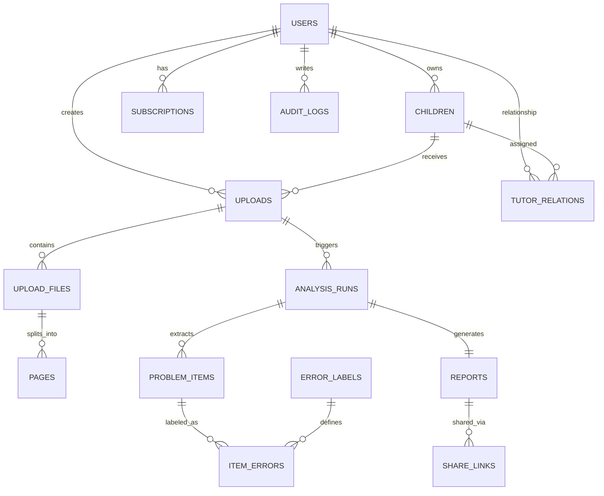
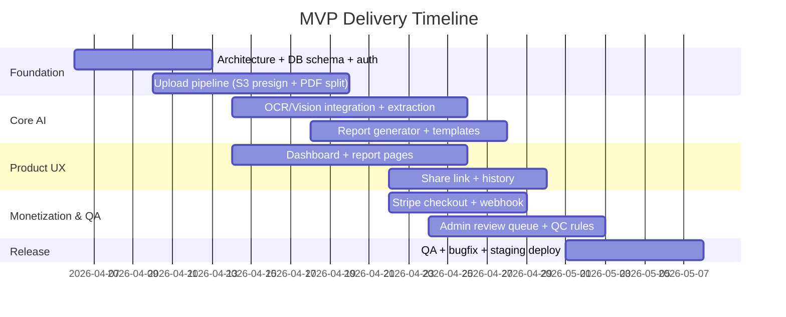

# 欧美市场 Web MVP PRD：Parent Dashboard（数学作业→7天学习诊断与周度复盘）

## Executive Summary

**执行摘要（约1页）**

本产品是面向欧美家庭（优先美国/英语市场）的 Web MVP：**家长仪表盘（Parent Dashboard）**。家长上传孩子最近 **5–10 页**数学作业/测验/错题订正页（图片或 PDF），系统在数分钟内输出一份**可执行的 7 天学习诊断与行动计划**，并提供**证据链（Evidence）**回溯到具体页/具体题目，支持**与 tutor 共享**，并在下一次上传时做**周度复盘**（趋势与重复错误跟踪）。

该产品不与“搜题/解题”工具正面竞争，而是聚焦家长与 tutor 的真实决策节点：  
- 考试/单元测后：到底哪里卡住？该补什么？要不要请 tutor？  
- 已请 tutor：是否有效？方向是否正确？  
- 作业连续不稳：是概念漏洞、步骤漏洞、审题问题还是粗心？  

参考欧美成熟产品的“诊断 + 下一步建议”模式（例如 **IXL Diagnostic** 强调“清晰诊断 + 个性化 next steps”citeturn1search0turn1search4turn1search8），本产品把输入从“做一套在线测评”改为“上传真实学习痕迹（作业/测验/订正页）”。同时借鉴 **Khan Academy/Khanmigo** 的“家长账户管理未成年人访问”式合规入口：Khanmigo 明确要求 **18+ 成人注册并可为子女开通访问**citeturn1search9turn3search2turn3search0。

技术上，MVP 将采用“**多模态识别 + 结构化抽取 + 错因归类 + 报告生成**”工作流：  
- 图像/文件输入：OpenAI API 支持以 URL/base64/file id 方式输入图片，并可一次传多张图片citeturn0search0turn0search24。  
- 数学/手写 OCR：可选用 **Mathpix**（擅长手写 STEM 与数学公式，输出 Mathpix Markdown/LaTeX）citeturn0search1turn0search33turn0search21；或用 **Google Cloud Vision OCR**（支持文档/手写识别，输出结构化块/段/词级信息）citeturn0search2turn0search6turn0search34。  
- 质量控制：OpenAI 平台提供数据与日志保留/控制说明，默认滥用监测日志最多保留 30 天（可据资质申请更严格策略）citeturn2search3turn2search19；结合置信度阈值与人审回合，确保报告不“套话”、不“乱判”。  

**MVP 成功衡量（上线 4–8 周内）**  
- 家长首单完成率（上传→拿到报告）：≥ 60%（付费后）  
- 报告“可执行性”主观评分（Likert 1–5）：均值 ≥ 4.2  
- 复购/二次上传率（7–14 天内）：≥ 25%  
- Tutor 分享使用率：≥ 15% 的报告被生成分享链接  
- 关键质量：低置信度报告进入人审队列比例 ≤ 20%，且人审后投诉率显著低于自动直出  

**产品一句话定位（中文）**  
把孩子最近 5–10 页数学作业/测验/订正页，转成**有证据链的错因诊断**与**7 天行动计划**，让家长和 tutor **这周就能做对事**。

---

## 用户与商业设计

**目标用户画像（Parents）**

- **角色**：8–15 岁孩子家长（优先 4–8 年级数学），英语为主；时间紧、愿意投入但缺乏专业判断。  
- **他们已经在做的事**：翻作业、看错题、问孩子“为什么错”、上网找题目讲解/刷练习。  
- **他们真正缺的**：把“零散作业痕迹”转成“可执行的下一周策略”的能力（不是答案）。  
- **典型心态**：焦虑但理性（愿意花钱减少试错），并对孩子使用 AI 的边界有顾虑，所以更能接受“诊断/复盘”而非“代做作业”。

**目标用户画像（Tutors / Small Centers）**

- **角色**：独立 tutor、小型 tutoring center、兼职老师。  
- **他们已经在做的事**：课前要看一堆作业/试卷，手写诊断、整理错因、写给家长的周报。  
- **他们真正缺的**：快速 intake（诊断）+ 专业化家长沟通材料（节省非授课时间）。  
- **付费动机**：节省分析时间、提升转化/续费率、标准化交付。

**关键场景/触发点（最容易付费）**

- **单元测 / quiz / test 后 24–72 小时**：家长要解释“这次为什么这样”，并决定接下来怎么补。  
- **准备请 tutor 前**：希望先诊断，避免浪费 tutor 预算。  
- **已请 tutor 但效果不清楚**：需要第三方视角做周度复盘。  
- **作业连续不稳（3 次以上）**：不确定是概念漏洞还是粗心/审题问题。  

**核心价值主张（结果导向）与付费理由（明确写给家长）**

家长会为以下“结果”付费，而不是为 OCR/AI 本身付费：

1. **看清根因**：不是“这题怎么做”，而是“孩子到底卡在概念/步骤/审题/习惯哪一类”。  
2. **减少试错成本**：避免“乱刷题、乱买课、乱请 tutor”。  
3. **获得可执行计划**：接下来 7 天每天 15–30 分钟做什么、先做什么、别做什么。  
4. **证据链可追溯**：每一个结论都能点回具体页/题，增强可信度与可沟通性。  
5. **对外沟通材料**：能直接带去和 tutor/老师沟通（节省家长表达成本）。  
6. **周度复盘与趋势**：重复错误变少了吗？策略要不要调整？  

对标参考：  
- **IXL Diagnostic** 以“清晰诊断 + 个性化 next steps”为核心价值表达citeturn1search0turn1search4turn1search12。  
- **Khanmigo** 强调为未成年人提供访问时需要家长/监护人参与的账户机制citeturn1search9turn3search2turn3search0，这说明“家长作为购买者与治理者”的入口在欧美是合理且常见的。

---

## MVP 范围与产品体验

**MVP 功能清单（按优先级 Must / Should / Future）**  
说明格式：**目的｜用户故事｜输入/输出｜验收标准**

### Must（必须有，MVP 交付范围）

**身份与合规入口**

- **家长注册/登录（Email + OAuth 可选）**  
  目的：建立“家长为购买者”的合规入口与数据隔离。  
  用户故事：家长创建账户并确认 18+，才能添加孩子记录与上传材料。  
  输入：email、密码（或 Google OAuth）、国家/时区、18+ 勾选。  
  输出：JWT/Session，用户个人区。  
  验收标准：  
  - 支持 Email 注册/登录/找回密码  
  - 注册时必须勾选“18+ parent/guardian”  
  - 未登录无法上传/查看报告  

- **孩子档案（Child Profile）**  
  目的：支撑多次上传、周度复盘与趋势。  
  用户故事：家长为孩子创建档案，只需一个昵称与年级。  
  输入：child_nickname（不要求真实姓名）、grade（4–8）、curriculum（可选：Common Core/UK）。  
  输出：child_id，用于上传与历史关联。  
  验收标准：  
  - 1 个家长账户可创建多个孩子  
  - 支持编辑年级/昵称  
  - 默认不收集学校名称、真实姓名（降低隐私风险）  

**上传与处理**

- **上传 5–10 页图片/PDF（拖拽、多文件、移动端可用）**  
  目的：最小摩擦输入真实“学习痕迹”。  
  用户故事：家长把手机拍的作业/试卷上传，或上传老师发的 PDF。  
  输入：JPG/PNG/HEIC（可选）/PDF；最多 10 页（PDF 自动拆页）。  
  输出：Upload Batch（upload_id）、页预览缩略图。  
  验收标准：  
  - 上传后可看到每页缩略图、页数计数、文件大小提示  
  - PDF 拆页成功率 ≥ 95%（常见 PDF）  
  - 对每页做基础质量检查（模糊/旋转/过暗提示）  

- **启动分析与进度页（Async Job）**  
  目的：让长耗时识别（OCR/模型）不阻塞 Web。  
  用户故事：点击“Generate Diagnosis”，看到进度（第几步、预计时间范围）。  
  输入：upload_id、child_id、可选备注（“本次单元：分数加减”）。  
  输出：analysis_run_id、状态（queued/running/needs_review/done/failed）。  
  验收标准：  
  - 分析状态可轮询或 WebSocket 推送  
  - 失败可重试（保留上传文件不丢）  
  - 超时（如 > 10 分钟）给出明确提示与联系客服入口  

**报告与页面（家长仪表盘核心）**

- **诊断页（Diagnosis）**  
  目的：用“人话 + 结构化结论”回答家长最关心的三件事。  
  用户故事：家长打开报告，第一屏就知道“问题在哪、严重程度、这周怎么做”。  
  输入：analysis_run 的结构化结果。  
  输出：Top findings（前 3 个）、重复错误模式、影响范围、置信度。  
  验收标准：  
  - 必须包含“本次最优先的 1–3 个问题”  
  - 必须区分“模式性问题 vs 偶发失误”  
  - 必须给出“建议先补什么/暂时别做什么”  

- **证据页（Evidence）**  
  目的：建立可信度：每个结论都能点回具体题目/页。  
  用户故事：家长点击“Why this?”看到引用的页与题号。  
  输入：每个 finding 对应的 evidence anchors（page_no、problem_no、截图区域可选）。  
  输出：证据列表（按错误类型分组），可查看对应页图。  
  验收标准：  
  - 每个 finding 至少引用 ≥2 条证据（除非页数不足）  
  - 点击证据可打开对应页并高亮区域（MVP 可先做到“跳页+题号”，高亮可选）  

- **7 天行动计划页（Action Plan）**  
  目的：把诊断变成“每天能执行”的方案。  
  用户故事：家长照着计划每天 15–30 分钟做，不再依赖自己拍脑袋。  
  输入：诊断结果 + 年级 + 常见练习形态（不会直接给作业答案）。  
  输出：7 天任务清单（每天 2–3 个任务，含家长提示语）。  
  验收标准：  
  - 每一天含：目标、练习建议、家长提问句、成功判定  
  - 明确“不要做什么”（如暂时别刷难题）  
  - 不直接输出作业题答案（防作弊定位）  

- **历史与周度复盘（History / Weekly Review）**  
  目的：形成订阅价值：重复错误是否减少？策略是否有效？  
  用户故事：家长一周后再次上传，系统对比两次报告，给出变化与下周重点。  
  输入：child_id 的多次 reports。  
  输出：趋势摘要（重复错误类别计数变化、重点迁移）、本周复盘卡片。  
  验收标准：  
  - 至少显示最近 3 次报告列表  
  - 支持“对比上次”：Top mistake patterns 变化（↑/↓/→）  
  - 支持家长写 1–2 句复盘笔记（可选）  

**分享与协作**

- **Tutor 共享链接（只读）**  
  目的：让家长把报告发给 tutor/老师，提高“沟通价值”。  
  用户故事：家长一键生成“只读链接”，发给 tutor。  
  输入：report_id、过期时间（默认 14 天）、访问权限（view only）。  
  输出：share_token URL（无需 tutor 登录即可查看摘要）。  
  验收标准：  
  - token 随机不可枚举（长度 ≥ 32 bytes）  
  - 可撤销（revoke）  
  - 默认隐藏孩子敏感个人信息，仅展示昵称与年级  

**付费（MVP 先跑通现金流）**

- **Stripe Checkout：单次诊断付费 + 订阅预埋**  
  目的：快速建立付费闭环（避免自建支付）。  
  Stripe Checkout/Session 能支持一次性或订阅付费citeturn1search11turn1search15turn1search3。  
  用户故事：家长在生成报告前或查看完整报告前完成支付。  
  输入：plan（one_time / monthly）、child_count、coupon（可选）。  
  输出：checkout_session_id、支付成功 webhook 更新订阅状态。  
  验收标准：  
  - 支付成功后自动解锁报告  
  - 支付失败/取消后回到“继续支付”  
  - webhook 幂等处理（同一事件不重复入账）  

**质量控制（最低限度的人审入口）**

- **低置信度进入“Needs Review”队列（Admin 仅内部）**  
  目的：避免 AI 套话/误判伤害信任。  
  用户故事：当 OCR/抽取置信度低时，系统把报告交给内部审核员快速确认再发给家长。  
  输入：analysis_run（含 confidence 指标）。  
  输出：审核通过/驳回/要求用户补拍。  
  验收标准：  
  - run.status 支持 needs_review  
  - admin 可查看页预览、抽取结构、生成的报告草稿  
  - 审核通过后才对家长展示完整报告（或展示“临时版 + 待确认”）  

### Should（次要，但建议在 MVP 后半段或紧随其后）

- Tutor 登录与 workspace（管理多个学生）  
- 邮件提醒（“周度复盘提醒”“报告已生成”）  
- 报告导出 PDF（更正式的家长沟通材料）  
- 多语言输出（输入可多语，但报告输出先支持 EN/ES）  
- 页内高亮（基于简单 bbox 或 canvas 标注）

### Future（未来版本）

- 自动映射到 Common Core skill tags / UK KS2/KS3 tags  
- “练习推荐”与题库对接（自建或第三方）  
- 家长会/teacher conference 问题清单生成  
- Tutor 端协同：评论、布置任务、追踪完成  
- 学校/区级（B2B）合规与采购版本

---

**页面与交互流程（完整页面列表 + 关键交互时序）**

> 说明：以下为 MVP Web 路由建议（可 Next.js App Router），并给出字段/组件清单与 ASCII wireframe。  
> 注：Wireframe 为示意，开发可直接拆成组件任务。

### 页面清单

- `/` 首页（Landing）  
- `/auth/signup` 注册（18+ gate）  
- `/auth/login` 登录  
- `/dashboard` 家长仪表盘（孩子列表 + 最近报告）  
- `/children/new` 新建孩子  
- `/children/[childId]` 孩子概览（历史报告、趋势卡）  
- `/children/[childId]/upload` 上传页  
- `/runs/[runId]` 分析进度页  
- `/reports/[reportId]/diagnosis` 诊断页  
- `/reports/[reportId]/evidence` 证据页  
- `/reports/[reportId]/plan` 7天执行单  
- `/billing` 付费/订阅页（含 Stripe 入口）  
- `/share/[token]` tutor 共享只读页  
- `/admin/review`（内部）审核队列  
- `/admin/review/[runId]`（内部）审核详情/编辑

### 首页（Landing）

组件/字段：价值主张、How it works、定价入口、案例截图（后续）、合规说明（家长账户）。  
Wireframe：

```text
+----------------------------------------------------+
| Logo | Sign in                                     |
|----------------------------------------------------|
| Headline: Turn math worksheets into a 7-day plan   |
| Sub: Upload 5–10 pages → diagnosis → action plan   |
| [Try a Diagnosis]   [See Sample Report]            |
|----------------------------------------------------|
| How it works: 1 Upload 2 Diagnose 3 Plan 4 Review   |
|----------------------------------------------------|
| Trust: evidence-based, parent-first, privacy-first |
+----------------------------------------------------+
```

验收：CTA 点击进入 signup 或 upload（未登录先跳转登录/注册）。

### 注册页（Signup）

关键字段：email、password、country、timezone、18+ 勾选、隐私条款勾选。  
参考：Khan Academy/Khanmigo 的做法是强调成人账户与孩子账户的链接机制citeturn3search3turn3search2turn3search0。  
Wireframe：

```text
+----------------------------+
| Create Parent Account      |
| Email [___________]        |
| Password [________]        |
| Country [US v] Timezone[v] |
| [ ] I am 18+ parent/guardian|
| [ ] Agree TOS/Privacy      |
| [Create Account]           |
+----------------------------+
```

验收：未勾 18+ 不可提交。

### 家长仪表盘（Dashboard）

组件：孩子卡片、最近一次报告状态、上传入口、订阅状态。  
Wireframe：

```text
+----------------------------------------------------+
| Parent Dashboard        | Billing | Account        |
|----------------------------------------------------|
| Children: [Add Child]                                 |
|  - Ava (Grade 6)   Last report: Mar 28  | [Upload] |
|  - Ben (Grade 4)   Last report: none               |
|----------------------------------------------------|
| Recent activity:                                     |
|  - Run #1234 Processing... [View status]            |
+----------------------------------------------------+
```

### 上传页（Upload）

组件：拖拽区、页预览、质量提示、备注（可选）、开始分析按钮。  
Wireframe：

```text
+----------------------------------------------------+
| Upload 5–10 pages (Homework / Quiz / Corrections)  |
| [ Drag & drop images/PDF here ]  [Browse]          |
|----------------------------------------------------|
| Pages preview:  [1][2][3][4][5]...                 |
| Quality flags: page 3 blurry, page 5 rotated       |
| Notes (optional): [ unit: fractions ]              |
| [Generate Diagnosis]                                |
+----------------------------------------------------+
```

验收：  
- <5 页提示“建议至少 5 页以提高诊断稳定性”（仍可继续，或强制 5 页，看商业策略）  
- >10 页禁止提交（提示分两次上传）

### 分析进度页（Run Status）

组件：步骤条、实时状态、预计时间范围、失败重试。  
Wireframe：

```text
+----------------------------------------------------+
| Generating report... (Run #1234)                   |
| Step 1/4 Upload OK                                 |
| Step 2/4 OCR + page parsing ... 45%                |
| Step 3/4 Error pattern analysis ...                |
| Step 4/4 Writing 7-day plan ...                    |
| [Refresh]  [Contact support]                       |
+----------------------------------------------------+
```

### 诊断页（Diagnosis）

组件：摘要卡（Top findings）、模式 vs 偶发、置信度提示、下一步 CTA（Evidence/Plan）。  
Wireframe：

```text
+----------------------------------------------------+
| Report: Ava (G6) | [Evidence] [7-day Plan] [Share] |
|----------------------------------------------------|
| Top 3 Findings                                     |
| 1) Fraction addition: common denominator missing   |
| 2) Sign errors under time pressure (pattern)       |
| 3) Word problems: misread "at least" vs "at most"  |
|----------------------------------------------------|
| Pattern summary (last 10 pages)                    |
| - Procedure gaps: 5 items (repeat)                 |
| - Careless slips: 2 items (sporadic)               |
|----------------------------------------------------|
| Recommendation: focus this week on #1 and #3       |
+----------------------------------------------------+
```

### 证据页（Evidence）

组件：错误类型分组、证据条目（页号/题号）、打开页图。  
Wireframe：

```text
+----------------------------------------------------+
| Evidence                                            |
|----------------------------------------------------|
| Procedure gap (5)                                  |
|  - p2 q4, p5 q2, p7 q1 ... [open]                  |
| Reading/comprehension (3)                           |
|  - p3 q5, p8 q2 ... [open]                         |
|----------------------------------------------------|
| Page viewer:                                       |
| [<] Page 5/9 [>]  (image)                          |
| Highlight: Question 2                              |
+----------------------------------------------------+
```

MVP 高亮实现建议：先“跳页 + 题号”，高亮可用简单 overlay（可由模型输出 bbox，或人工标注）。

### 7天执行单（Plan）

组件：Day 1–7 卡片、任务、家长提示语、完成勾选、下次复盘入口。  
Wireframe：

```text
+----------------------------------------------------+
| 7-day Action Plan                                   |
| Day 1 (15–20 min): Fractions foundations            |
| - Task: 5 min review + 10 min practice              |
| - Parent prompt: "Show me how you found the LCD."   |
| - Success check: explain steps w/o help             |
| [Mark done]                                         |
| ... Day 7                                            |
| [Schedule weekly review]                             |
+----------------------------------------------------+
```

### 历史/复盘页（History / Weekly Review）

组件：报告列表、对比上次、趋势变化、复盘笔记。  
Wireframe：

```text
+----------------------------------------------------+
| Weekly Review                                       |
| Reports:  Mar 28 | Mar 15 | Feb 28                 |
| Compare Mar 28 vs Mar 15                            |
| - Procedure gaps: 5 → 3 (improving)                 |
| - Reading errors: 2 → 4 (worsened)                  |
| Next focus: word problems vocabulary                |
| Parent notes: [____________________]                |
+----------------------------------------------------+
```

### 付费页（Billing）

Stripe Checkout 引导页：  
- 单次诊断（one-time）  
- 月订阅（monthly）  
Stripe 官方文档支持通过 Checkout Sessions 创建一次性或订阅支付citeturn1search15turn1search11turn1search3。

### Tutor 共享页（Share）

只读展示：诊断摘要 + 证据列表 + 7天计划（可隐藏“家长内部备注”）。  
访问控制：token + 过期 + 撤销。

---

## AI 与识别工作流

**报告模板与 7 天执行单结构（示例）**  
> MVP 输出三种版本：家长版（默认）、学生版（更鼓励式）、tutor 版（更技术化）。三种版本共享同一结构化“事实层”，只有语言和建议粒度不同。

### 家长版（Parent Report Template）

**Title**：Weekly Math Diagnosis & 7‑Day Plan  
**Child**：Ava (Grade 6)｜**Date**：2026‑04‑03｜**Materials**：9 pages

**A. 本次结论（1屏读完）**  
- **最优先问题（1–2 个）**：  
  - *Procedure gap*: 分数加减没有先统一分母，导致连续错误。  
- **次要问题**：  
  - *Reading/comprehension*: 文字题关键词（“at least/at most”）理解不稳定。  
- **不用过度担心的**：  
  - 粗心错 2 次，属于偶发（非主要瓶颈）。

**B. 证据（Why we think so）**  
- 证据 1：Page 2 Q4（同分母步骤缺失）  
- 证据 2：Page 5 Q2（同类错误重复）  
- 证据 3：Page 8 Q2（关键词误读）

**C. 7 天行动计划（每天 15–30 分钟）**  
- Day 1：分数统一分母“步骤口述” + 5 题基础练习  
- Day 2：同类题型 6 题，要求写出每一步理由（不追求速度）  
- Day 3：文字题关键词卡片（at least/at most/more than/less than）+ 4 题  
- Day 4：混合练习（分数 4 题 + 文字题 2 题）  
- Day 5：小测（10 分钟）+ 错因复盘（5 分钟）  
- Day 6：针对 Day 5 错题做“订正解释”  
- Day 7：轻量复习 + 预备下周上传复盘

**D. 是否需要 tutor？**  
- 建议：若 2 周后分数步骤仍反复出错，可考虑短期 tutor 集中补“分数运算步骤与表达”。

### 学生版（Student Report Template）

更强调鼓励与可控任务：  
- “你已经会什么”  
- “这周只抓 1–2 个关键动作”  
- “用 1 句话解释你的步骤”  
- 不出现“你不行”，只出现“你可以用这个方法更稳定”。

### Tutor 版（Tutor Report Template）

更强调：错误模式、优先级、干预建议、可测量目标。  
包含：  
- Error taxonomy 分布（counts）  
- 典型错题抽样（page/number）  
- Suggested interventions（2 weeks）  
- Metrics（正确率/步骤完整率/审题关键词命中率）

---

**错误类型 taxonomy（至少 6 类）与判定规则/示例**

> 分类目标：让“诊断”不是套话，而是可复用的结构化标签，直接驱动行动计划。

建议 MVP taxonomy（8 类；至少前 6 类必做）：

1. **Concept Gap（概念漏洞）**  
   规则：同一概念相关题反复错；即使步骤正确也选错方法；解释不清“为什么”。  
   示例：把“分子/分母意义”理解错；把“平均数”当“中位数”。

2. **Procedure Gap（步骤/算法漏洞）**  
   规则：方法方向正确，但缺关键步骤或步骤顺序错误，导致结果错。  
   示例：分数加减未统一分母；解方程移项符号处理顺序错。

3. **Calculation Slip（计算失误）**  
   规则：步骤与方法正确，但基础算术错；错误多为单点、可被复算纠正。  
   示例：7×8 算错；负数加减算错。

4. **Reading/Comprehension Issue（审题/理解问题）**  
   规则：错误集中在文字题；关键信息遗漏；把“at least”当“at most”。  
   示例：忽略单位；误读条件。

5. **Representation/Notation Error（表达/符号/单位错误）**  
   规则：符号、单位、括号、十进制点、分数线等表示不规范导致错。  
   示例：把 0.5 写成 0,5；单位未转换；括号漏写导致运算优先级变化。

6. **Strategy Selection Error（策略选择不当）**  
   规则：题目适合某种方法，但学生选择了不匹配策略；过程看似合理但方向偏。  
   示例：比例题用加法思路；面积题误用周长公式。

7. **Careless/Attention Slip（粗心/注意力波动）**  
   规则：错误不成模式；同类题大多对；多出在抄写/漏符号/跳步。  
   示例：抄错数字；漏写负号；最后一步单位漏写。

8. **Incomplete Reasoning / Communication（步骤表达不完整）**  
   规则：会做但写不全；关键推导缺失；导致老师判错或自己复盘困难。  
   示例：直接写答案不写过程；缺“等式变形”的中间步骤。

**判定实现建议（MVP 可落地）**  
- 先从 OCR/图像抽取每题：题干、学生作答、老师批注（对勾/叉/分数/“show work”）  
- 再做“错题归因”时用规则优先+模型补充：  
  - 若同类错误跨 ≥2 页重复：优先判为 Concept/Procedure/Reading（模式性）  
  - 若仅一题出现且为算术错：倾向 Calculation/Careless  
  - 若出现关键词误读或单位漏：Reading/Notation 优先  
- 输出必须附证据 anchors（page_no, problem_no, snippet）

---

**图像处理与识别需求（图片/PDF/手写/OCR/语言检测）**

### 输入要求（MVP）

- 支持：JPG/PNG（必需），PDF（必需），HEIC（可选，移动端常见）  
- 每次上传：5–10 页（建议），最大 10 页（限制成本与延迟）  
- 每页图像最短边 ≥ 1200px（低于提示重新拍）  
- 预处理：自动旋转（EXIF）、去噪（轻量）、倾斜矫正（可选）、对比度增强（可选）

### OCR/数学公式识别：推荐组件与取舍

| 组件/服务 | 适用场景 | 优点 | 缺点/风险 | 引用 |
|---|---|---|---|---|
| **entity["company","OpenAI","api platform"] Vision（通过 OpenAI API）** | 直接从图片理解题目/作答/批注 | 支持多张图片输入、可与推理/生成一体化citeturn0search0turn0search24 | 对“手写公式结构化抽取”稳定性不如专用 math OCR；需要强 QC | citeturn0search0turn0search24 |
| **entity["company","Mathpix","stemdigitizing api"] OCR/Convert API** | STEM 文档、手写数学、公式→LaTeX/MMD | 明确支持手写 STEM/数学，输出 Mathpix Markdown/LaTeXciteturn0search1turn0search33turn0search21 | 付费；PDF OCR 异步；需要管理 key 与成本citeturn2search2turn2search6 | citeturn0search1turn2search2turn0search21 |
| **entity["organization","Google Cloud Vision API","ocr service"] OCR** | 文档 OCR、手写文本、结构化段落信息 | 支持 DOCUMENT_TEXT_DETECTION 与手写识别说明citeturn0search2turn0search6，有语言支持列表citeturn0search34 | 数学公式结构化（LaTeX）能力有限；更多是文本 OCR | citeturn0search2turn0search6turn0search34 |
| **entity["organization","Tesseract OCR","open source engine"]（开源）** | 打印体为主、离线/低成本 | 开源成熟；Tesseract 4 引入 LSTM OCRciteturn2search0 | 官方 FAQ 也承认手写效果不佳（主要为印刷体设计）citeturn2search16；数学表达能力弱 | citeturn2search0turn2search16 |

**MVP 建议路线（兼顾成本与准确性）**

- **默认：OpenAI Vision 做页面理解 + 结构化抽取**（题号/对错/错误模式/建议）  
- **可选增强（建议很快接入）：Mathpix 作为“手写数学/公式结构化抽取”的 fallback**  
- Google Vision 可用于“文档文字 OCR”增强，但对数学公式帮助有限  
- Tesseract 仅建议用于低成本试验或打印体场景，且不作为手写主力citeturn2search16

---

**AI/模型工作流（提示词、后处理、置信度、人审与 QC）**

### 工作流概览（Mermaid）

```mermaid
flowchart TD
  A[Upload images/PDF 5-10 pages] --> B[Preprocess: de-skew, rotate, quality check]
  B --> C{Need math-structured OCR?}
  C -- yes --> D[Math OCR: Mathpix Convert API]
  C -- no --> E[Vision parsing: OpenAI Vision]
  D --> F[Normalize to canonical schema]
  E --> F[Normalize to canonical schema]
  F --> G[Item extraction: problems, answers, teacher marks]
  G --> H[Error labeling with taxonomy + evidence anchors]
  H --> I[Aggregate patterns + confidence scoring]
  I --> J{confidence >= threshold?}
  J -- yes --> K[Generate Parent/Student/Tutor reports + 7-day plan]
  J -- no --> L[Needs review queue (admin)]
  L --> K
  K --> M[Publish report + share link + history]
```

### 提示词设计要点（MVP 必须遵循）

- **强结构化输出**：JSON schema 固定字段（见下方 API/DB），禁止自由散文先行。  
- **“先抽取事实层，再写报告”**：  
  - 第一步只做抽取与标注（problem items, correctness signals, evidence）。  
  - 第二步才基于抽取结果生成报告文本。  
- **避免“给答案”**：系统提示明确要求不输出作业答案，只输出“错因类别 + 纠错策略 + 练习建议”。（这也符合与 Khanmigo 类似的“引导而非直接给答案”的安全定位表达citeturn3search1turn3search4。）  
- **语言策略**：  
  - 输入语言自动检测（或基于 OCR/模型推断），但报告输出默认英文；将来支持 EN/ES。  

### 后处理规则（Deterministic Post-processing）

- **证据最小数量**：每个 finding 至少 2 条 evidence，否则降置信度。  
- **重复错误判定**：同 taxonomy_code 在不同页/题出现 ≥2 次 → 标记为 pattern。  
- **粗心/偶发判定**：若 taxonomy_code=careless/calculation 且总体只出现 1 次 → 标记为 sporadic。  
- **“建议 tutor”阈值**（MVP 简化）：  
  - pattern 严重度 high + 连续两次 report 仍未改善 → 建议考虑 tutor。  
  - 否则只给“可选建议”，避免激进营销引发反感。

### 置信度阈值（Confidence）

MVP 可用组合分数：  
- OCR engine confidence（若有，Mathpix/Google 会提供置信度信息接口说明中提及可请求 confidence）citeturn0search21  
- 模型自评 confidence（要求 0–1）  
- 规则一致性（teacher mark 与模型判定一致性）

建议阈值：  
- `overall_confidence >= 0.70`：自动发布  
- `0.50–0.70`：发布“临时版”，提示“建议补拍/可能有误”，并进入抽样人审  
- `<0.50`：必须 needs_review（不向用户展示完整结论）

### 人工审核回合（半自动流程）

- 触发条件：低置信度、页质量差、题目抽取数量过少、证据不足。  
- 审核员可做：  
  - 标记“请用户补拍第 X 页”  
  - 编辑 finding 文本（不改结构字段）  
  - 调整 taxonomy 标签  
  - 通过/驳回  
- 质量控制：  
  - 每周抽检 10% 自动发布报告  
  - 记录“投诉/纠错”样本回流训练（仅内部数据，不自动进入外部训练）

**数据与隐私（OpenAI/平台方面的关键约束）**  
- OpenAI 平台文档说明：默认会生成滥用监测日志，可能包含提示与响应内容，通常保留最多 30 天citeturn2search3；企业/符合条件组织可配置更严格数据保留策略（含零保留选项）citeturn2search19。  
- 因此 MVP 必须：  
  - 用户侧提供“删除上传材料/删除孩子档案”入口  
  - 内部设定对象存储生命周期（如 30/90 天自动清理）  
  - 合同/隐私政策明确说明第三方处理器（OpenAI、OCR 服务等）

---

## 数据与接口规格

**数据库模型（ER 图 + 字段表）**

### ER 图（Mermaid）



### 表结构（MVP 级别；PostgreSQL 推荐）

> 字段类型为建议，可根据 ORM（Prisma/SQLAlchemy）调整。索引建议写在表下方。

**users**

| 字段 | 类型 | 约束 | 示例 |
|---|---|---|---|
| id | uuid | PK | `b7...` |
| email | text | unique, not null | `parent@example.com` |
| password_hash | text | nullable（OAuth 时可空） | `...` |
| role | text | not null (`parent`,`tutor`,`admin`) | `parent` |
| country | text | not null | `US` |
| timezone | text | not null | `America/Los_Angeles` |
| locale | text | not null default `en-US` | `en-US` |
| is_18plus_confirmed | boolean | not null default false | true |
| created_at | timestamptz | not null |  |
| last_login_at | timestamptz |  |  |

索引：`unique(email)`；`idx_users_role`

**children**

| 字段 | 类型 | 约束 | 示例 |
|---|---|---|---|
| id | uuid | PK |  |
| user_id | uuid | FK users.id |  |
| nickname | text | not null | `Ava` |
| grade | int | not null (4–12 可扩) | 6 |
| curriculum | text | default `US-CommonCore` | `US-CommonCore` |
| created_at | timestamptz | not null |  |

索引：`idx_children_user_id`

**uploads**

| 字段 | 类型 | 约束 | 示例 |
|---|---|---|---|
| id | uuid | PK |  |
| user_id | uuid | FK users.id |  |
| child_id | uuid | FK children.id |  |
| source_type | text | not null (`homework`,`quiz`,`test`,`corrections`,`mixed`) | `quiz` |
| notes | text | nullable | `unit: fractions` |
| status | text | not null | `uploaded` |
| created_at | timestamptz | not null |  |

索引：`idx_uploads_child_id_created_at`

**upload_files**

| 字段 | 类型 | 约束 | 示例 |
|---|---|---|---|
| id | uuid | PK |  |
| upload_id | uuid | FK uploads.id |  |
| file_type | text | not null (`pdf`,`image`) | `pdf` |
| storage_key | text | not null | `s3://...` |
| page_count | int | not null default 0 | 9 |
| checksum_sha256 | text | not null |  |
| created_at | timestamptz | not null |  |

索引：`idx_upload_files_upload_id`

**pages**

| 字段 | 类型 | 约束 | 示例 |
|---|---|---|---|
| id | uuid | PK |  |
| upload_file_id | uuid | FK upload_files.id |  |
| page_no | int | not null | 5 |
| image_storage_key | text | not null | `s3://.../p5.png` |
| quality_flags | jsonb | not null default `{}` | `{blur:true}` |
| detected_language | text | nullable | `en` |
| ocr_engine | text | nullable (`openai`,`mathpix`,`googlevision`) | `mathpix` |
| ocr_text | text | nullable |  |
| ocr_confidence | float | nullable | 0.82 |
| created_at | timestamptz | not null |  |

索引：`idx_pages_upload_file_id_page_no`

**analysis_runs**

| 字段 | 类型 | 约束 | 示例 |
|---|---|---|---|
| id | uuid | PK |  |
| upload_id | uuid | FK uploads.id |  |
| status | text | not null (`queued`,`running`,`needs_review`,`done`,`failed`) | `running` |
| model_version | text | not null | `gpt-4o-mini`（示例） |
| overall_confidence | float | nullable | 0.74 |
| error_message | text | nullable |  |
| started_at | timestamptz | nullable |  |
| finished_at | timestamptz | nullable |  |

索引：`idx_runs_upload_id`；`idx_runs_status`

**problem_items**（按题抽取的结构化条目）

| 字段 | 类型 | 约束 | 示例 |
|---|---|---|---|
| id | uuid | PK |  |
| run_id | uuid | FK analysis_runs.id |  |
| page_id | uuid | FK pages.id |  |
| problem_no | text | not null | `Q2` |
| problem_text | text | nullable |  |
| student_work | text | nullable |  |
| teacher_mark | text | nullable (`correct`,`wrong`,`partial`,`unknown`) | `wrong` |
| model_is_correct | boolean | nullable | false |
| item_confidence | float | nullable | 0.66 |
| evidence_anchor | jsonb | not null default `{}` | `{page:5, problem:"Q2"}` |

索引：`idx_items_run_id`；`idx_items_page_id`

**error_labels**

| 字段 | 类型 | 约束 | 示例 |
|---|---|---|---|
| id | uuid | PK |  |
| code | text | unique, not null | `procedure_gap` |
| display_name | text | not null | `Procedure gap` |
| description | text | not null |  |

**item_errors**

| 字段 | 类型 | 约束 | 示例 |
|---|---|---|---|
| id | uuid | PK |  |
| item_id | uuid | FK problem_items.id |  |
| label_id | uuid | FK error_labels.id |  |
| severity | text | not null (`low`,`med`,`high`) | `high` |
| rationale | text | nullable |  |
| confidence | float | nullable | 0.71 |

索引：`idx_item_errors_item_id`

**reports**

| 字段 | 类型 | 约束 | 示例 |
|---|---|---|---|
| id | uuid | PK |  |
| run_id | uuid | FK analysis_runs.id unique |  |
| parent_report_json | jsonb | not null |  |
| student_report_json | jsonb | not null |  |
| tutor_report_json | jsonb | not null |  |
| pdf_storage_key | text | nullable |  |
| created_at | timestamptz | not null |  |

**share_links**

| 字段 | 类型 | 约束 | 示例 |
|---|---|---|---|
| id | uuid | PK |  |
| report_id | uuid | FK reports.id |  |
| token | text | unique, not null | `rpt_...` |
| expires_at | timestamptz | not null |  |
| revoked_at | timestamptz | nullable |  |
| created_by_user_id | uuid | FK users.id |  |

索引：`unique(token)`；`idx_share_report_id`

**subscriptions**（Stripe）

| 字段 | 类型 | 约束 | 示例 |
|---|---|---|---|
| id | uuid | PK |  |
| user_id | uuid | FK users.id |  |
| provider | text | not null default `stripe` | `stripe` |
| stripe_customer_id | text | not null |  |
| stripe_subscription_id | text | nullable |  |
| plan | text | not null (`one_time`,`monthly`,`tutor_monthly`) | `monthly` |
| status | text | not null | `active` |
| current_period_end | timestamptz | nullable |  |

索引：`idx_sub_user_id`

**API 设计概要（主要端点 + 示例）**

认证方式：  
- MVP 推荐 **HTTP-only cookie session** 或 JWT（access+refresh）。  
- 所有 `/api/*` 需要 CSRF 防护（若 cookie session）。

### Auth

- `POST /api/auth/signup`  
- `POST /api/auth/login`  
- `POST /api/auth/logout`  
- `GET /api/auth/me`

请求示例（signup）：

```json
{
  "email": "parent@example.com",
  "password": "********",
  "country": "US",
  "timezone": "America/Los_Angeles",
  "is18PlusConfirmed": true
}
```

响应示例：

```json
{
  "user": {
    "id": "uuid",
    "email": "parent@example.com",
    "role": "parent"
  }
}
```

### Children

- `POST /api/children`  
- `GET /api/children`  
- `GET /api/children/:childId`  
- `PATCH /api/children/:childId`

### Upload & Run

- `POST /api/uploads`（创建 upload 记录）  
- `POST /api/uploads/:uploadId/files/presign`（获取预签名上传 URL）  
- `POST /api/uploads/:uploadId/submit`（启动分析，生成 run）  
- `GET /api/runs/:runId`（进度/状态）  

`POST /api/uploads/:uploadId/submit` 请求：

```json
{
  "sourceType": "quiz",
  "notes": "unit: fractions"
}
```

响应：

```json
{
  "runId": "uuid",
  "status": "queued"
}
```

### Reports

- `GET /api/reports/:reportId`（返回 parent/student/tutor 版本，按权限）  
- `POST /api/reports/:reportId/share`（生成 share token）  
- `GET /api/share/:token`（只读报告内容）

### Billing（Stripe）

- `POST /api/billing/checkout-session`  
- `POST /api/billing/webhook`（Stripe webhook）  
Stripe Checkout Sessions 用于一次性或订阅支付citeturn1search15turn1search11。

请求示例：

```json
{
  "plan": "one_time",
  "successUrl": "https://app.example.com/dashboard?paid=1",
  "cancelUrl": "https://app.example.com/billing?canceled=1"
}
```

响应：

```json
{
  "checkoutSessionId": "cs_test_...",
  "checkoutUrl": "https://checkout.stripe.com/..."
}
```

### Admin（内部）

- `GET /api/admin/review?status=needs_review`  
- `POST /api/admin/review/:runId/approve`  
- `POST /api/admin/review/:runId/request-more-photos`

---

## 技术实现、测试、上线节奏与风险

**技术栈与部署建议（Web MVP）**

前端（Web）  
- Next.js（App Router）+ React + Tailwind（或 Chakra）  
- 文件上传：分片上传（可选）+ 预签名 URL  
- PDF 预览/拆页：pdf.js（前端预览）+ 后端拆页（更稳）

后端  
- FastAPI / Node(NestJS) 任一；建议 FastAPI（便于异步任务与 Python OCR SDK）  
- 异步任务队列：Celery + Redis / BullMQ（Node）  
- 数据库：PostgreSQL  
- 存储：S3（或 Cloudflare R2）+ CDN（CloudFront/Cloudflare）

模型与 OCR  
- OpenAI API（Vision + 结构化生成）：支持图片输入（URL/base64/file id）citeturn0search0turn0search24  
- 手写数学增强：Mathpix Convert API（v3/text、v3/pdf）citeturn0search21turn0search1  
- 备选 OCR：Google Cloud Vision（DOCUMENT_TEXT_DETECTION/handwriting）citeturn0search2turn0search6  

支付  
- Stripe Checkout + Billing（最快上线订阅/一次性）citeturn1search3turn1search11turn1search19  

监控与日志  
- Sentry（前后端）  
- OpenTelemetry + Grafana（可选）  
- 对象存储访问日志 + 安全告警

**隐私与合规要点（COPPA/GDPR）**

COPPA（美国，13 岁以下）  
- FTC 对 COPPA 的说明：对面向 13 岁以下儿童或“明知收集儿童信息”的服务有要求citeturn0search3turn0search7。  
- 关键策略：  
  - 产品定位为 **家长工具**（parent-first），注册必须 18+  
  - 不要求孩子直接注册/登录（减少“从儿童收集信息”的风险面）  
  - 仅收集最小孩子信息（昵称、年级）  
  - 提供删除机制、隐私政策与家长控制  
  - 如未来引入孩子直接使用功能，需评估 verifiable parental consent（FTC 有专门说明）citeturn0search19turn0search11  

GDPR（欧盟）  
- EDPB 指南明确：儿童在信息社会服务中的同意年龄可由成员国设为 13–16；低于该年龄通常需要监护人同意，并须采取合理努力验证同意者具监护权citeturn2search5turn2search21。  
- MVP 建议先以美国市场上线，欧盟扩张前完善：DPA（数据处理协议）、数据保留策略、年龄保证（age assurance）框架（EDPB 有相关原则文件）citeturn2search13。

**测试用例与验收标准（功能/性能/识别/体验）**

功能测试（关键路径）  
- 注册：未勾 18+ 不能注册  
- 创建孩子：昵称/年级必填  
- 上传：  
  - 上传 5 张图片成功、生成预览  
  - 上传 PDF 自动拆页成功  
  - 超过 10 页拦截  
- 分析：  
  - run 状态从 queued→running→done  
  - failed 可重试  
- 报告：  
  - diagnosis/evidence/plan 三页可访问  
  - 每个 finding 有证据链接  
- 分享：  
  - 生成 share token 可访问只读页  
  - revoke 后 token 失效  
- 支付：  
  - Stripe 支付成功 webhook 解锁报告  
  - webhook 重放不产生重复订单（幂等）  

性能与可靠性  
- 上传 10 页总时长（典型家庭网络）：< 60 秒（无强依赖，但可监控）  
- 报告生成 P95：< 6 分钟（取决于 OCR/模型；MVP 以体验为目标）  
- API P95：< 500ms（非分析任务端点）  
- 存储与数据库：每日备份 + 恢复演练（至少月度）

OCR/识别准确度目标（MVP 合理目标，需通过样本集评估）  
- 打印体 worksheet：题号/对错识别准确率 ≥ 90%  
- 混合手写：题号/对错识别准确率 ≥ 75%（低置信度进入人审）  
- 错误类型标签一致性（与人工标注一致）：≥ 70%（MVP 目标）  
- “证据链可追溯”覆盖率：≥ 95%（每个 finding 可跳到页/题）

用户体验指标（上线后监控）  
- 首次上传完成率  
- 报告阅读完成率（诊断页滚动到底）  
- 7 天计划勾选次数（行为指标）  
- 复盘二次上传率（7–14 天）

---

**最小可交付时间线（里程碑 + 人日估算）**

> 假设：1 名前端 + 1 名后端 + 0.5 名全栈/PM（或你兼任）+ 0.5 名 QA（兼职）。  
> 目标：4–6 周交付可用 MVP；6–8 周增强 QC 与复盘体验。



---

**初始定价与商业化路径建议（MVP 建议）**

对标参考：Khanmigo 面向家长/学习者的订阅价格为 $4/月或 $44/年citeturn1search1turn1search5（偏低价 AI tutor 工具）。本产品卖点更接近“诊断 + 行动方案 + 复盘”，应采用更高价值定价，但仍远低于真人 tutor。

建议定价（美国起步）  
- **单次诊断（One-time）**：$19–$29（含一份报告 + 7 天计划）  
- **月订阅（Monthly）**：$39–$59（含每周 1 次上传/复盘 + 历史趋势）  
- **Tutor 版（Monthly）**：$99–$199（多学生 intake + 周报草稿 + 家长沟通模板）

获客建议（MVP 阶段）  
- Tutor 合作：给 tutor 端免费试用换案例（最容易形成 B2B2C）  
- 家长社群：以“单元测后复盘模板”内容引流  
- SEO：关键词聚焦“math test review”、“mistake patterns”、“7-day action plan”  
- 产品内分享：share link 自带品牌水印与 CTA（转化 tutor 与新家长）

---

**风险与缓解措施（技术/合规/信任/误判）**

技术风险  
- 手写与数学公式抽取不稳：用 Mathpix fallback + 低置信度进人审citeturn0search1turn0search21turn2search6  
- PDF 拆页/旋转问题：预处理质量检测 + 让用户在上传页手动旋转/删除页  
- 成本失控：限制每次 10 页；缓存 OCR；订阅用户限制频率

合规风险（COPPA/GDPR）  
- 儿童数据处理：坚持 parent-first、最小化收集、删除机制；欧盟扩张前补齐 GDPR 合规与年龄同意策略citeturn0search7turn2search5turn2search21

用户信任与误判风险  
- 报告“像套话”：强制 evidence anchors；没有证据就降级；人审兜底  
- 过度建议请 tutor：把“是否需要 tutor”变成条件建议，并解释触发依据  
- 被认为“帮孩子作弊”：明确不输出作业答案，只做诊断与学习策略（与“引导而非直接给答案”的安全定位一致citeturn3search1）

---

## 附：示例 Prompt（GPTs/模型调用模板）与示例输入输出

> 下面提供可直接用于 OpenAI API 的“结构化抽取 → 诊断聚合 → 报告生成”三段式提示词。  
> 注意：OpenAI API 支持多张图片输入（URL/base64/file id），可把 5–10 页作为一个请求或分批请求citeturn0search0turn0search24。

### Prompt A：页面抽取（每页或每 2 页一批）

**System（核心约束）**  
- 你是“学习诊断抽取器”，只输出 JSON，不输出散文。  
- 不提供题目答案；只抽取题干与学生作答/老师批注信号。  
- 识别：题号、题干、学生步骤、最终答案、老师对错标记（如对勾/叉/分数/圈）。  
- 输出中每个条目必须包含 `evidence_anchor`（pageNo, problemNo）。  

**User（输入）**  
- 图片：page_1.png（附）  
- 元数据：grade=6; locale=en-US; sourceType=quiz

**Expected JSON schema（示例）**

```json
{
  "pageNo": 1,
  "detectedLanguage": "en",
  "items": [
    {
      "problemNo": "Q1",
      "problemText": "...",
      "studentWork": "...",
      "studentAnswer": "...",
      "teacherMark": "wrong",
      "evidenceAnchor": { "pageNo": 1, "problemNo": "Q1" },
      "itemConfidence": 0.78
    }
  ],
  "pageConfidence": 0.74,
  "qualityFlags": { "blurry": false, "rotated": false }
}
```

### Prompt B：错因标注（taxonomy labeling）

**System**  
- 输入是多个 page extraction JSON；输出是对每个 item 的错误类型标签与理由。  
- 使用固定 taxonomy codes：concept_gap, procedure_gap, calculation_slip, reading_issue, notation_error, strategy_error, careless_slip, incomplete_reasoning。  
- 必须给出 `labelConfidence` 与 1–2 句 `rationale`（引用具体 evidence anchors）。  
- 不提供作业答案。

**Expected output（示例）**

```json
{
  "labeledItems": [
    {
      "pageNo": 2,
      "problemNo": "Q4",
      "isCorrect": false,
      "labels": [
        { "code": "procedure_gap", "severity": "high", "labelConfidence": 0.72 }
      ],
      "rationale": "Skipped finding a common denominator before adding fractions.",
      "evidenceAnchor": { "pageNo": 2, "problemNo": "Q4" }
    }
  ]
}
```

### Prompt C：聚合与报告生成（Parent/Student/Tutor 三版本）

**System**  
- 输入是 labeledItems + child grade + previous report summary（如有）。  
- 输出三份报告：parent、student、tutor。  
- 每个 finding 必须引用 ≥2 个 evidence anchors，否则不允许输出该 finding。  
- 输出必须包含 7 天行动计划（每天 15–30 分钟）。  
- 不输出题目答案。

**Expected output（示例提要）**

```json
{
  "overallConfidence": 0.71,
  "parentReport": {
    "topFindings": [
      {
        "title": "Fraction addition: missing common denominator",
        "taxonomyCode": "procedure_gap",
        "evidence": [
          { "pageNo": 2, "problemNo": "Q4" },
          { "pageNo": 5, "problemNo": "Q2" }
        ],
        "whatToDo": "Practice step-by-step LCD process..."
      }
    ],
    "sevenDayPlan": [
      { "day": 1, "minutes": 20, "tasks": ["..."], "parentPrompt": "..." }
    ]
  },
  "studentReport": { "...": "..." },
  "tutorReport": { "...": "..." }
}
```

---

**示例输入（图片描述示例）与输出对照（简化版）**

- 输入：  
  - Page 2：分数加减题，学生直接相加分子，未统一分母；老师画叉  
  - Page 5：类似题再次出现相同错误  
- 输出：  
  - Pattern：procedure_gap（重复 2+ 次）  
  - Plan：Day1–Day3 集中训练“统一分母步骤口述 + 基础题”，Day4–Day7 混合练习与小测复盘  

---

**参考资料（权威来源已在文中引用）**  
- OpenAI：Images & Vision guide、File inputs、Data retention controlsciteturn0search0turn0search24turn2search3  
- Mathpix：OCR/Convert API 识别与端点说明、计费与定价citeturn0search1turn0search21turn2search2turn2search6  
- Google Cloud Vision：OCR/手写识别与语言支持citeturn0search2turn0search6turn0search34  
- Khan Academy / Khanmigo：家长账户与未成年人访问机制、定价与负责 AI 说明citeturn1search1turn1search9turn3search2turn3search0  
- IXL Diagnostic：诊断与 next steps 的价值表达citeturn1search0turn1search4turn1search8  
- Stripe：Checkout/Billing/Checkout Sessions 文档citeturn1search11turn1search15turn1search3  
- FTC COPPA：规则与 FAQ、家长同意与最新政策动向citeturn0search3turn0search7turn0search11turn0search19  
- EDPB/GDPR 儿童同意：处理儿童数据的同意年龄与监护人要求citeturn2search5turn2search21turn2search13