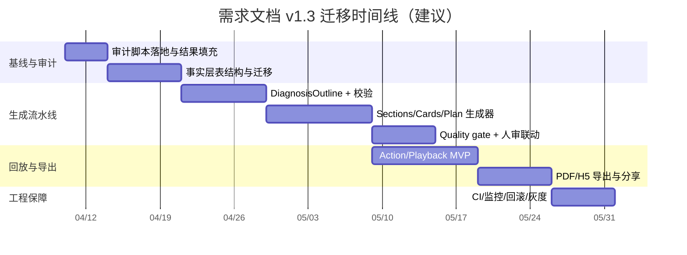

# 需求文档_1.3

> 文件名：`需求文档_1.3.md`  
> 日期：2026-04-10（Asia/Jakarta）  
> 适用范围：Parent Dashboard / FamilyEducation（数学作业上传 → 学习诊断报告 / 错题讲解 / 7 天训练方案）  
> 参考仓库：entity["organization","OpenMAIC","open-source classroom repo"]（entity["company","GitHub","code hosting platform"]：THU-MAIC/OpenMAIC）

## 执行摘要

本版本的目标是把你现有系统从“能生成报告”升级为**可控、可校验、可回放、可导出**的“学习诊断生成系统”，并将三类产物用统一的数据模型与流水线贯通：

- 学习诊断报告：面向家长（含 evidence 证据链、pattern vs sporadic、do-not-overreact、置信度门禁与人审）
- 错题讲解：以“讲解卡片（ExplanationCard）+ 可执行动作（Action[]）”为核心，支持逐步回放与 H5 分享
- 7 天训练方案：以“处方（SevenDayPlan）”为核心，强调每日目标、时长、家长提示语与验收标准

由于你本地代码仓库路径未提供，本需求文档对“现有代码审计”部分提供**可直接执行的自动化审计脚本**与**可粘贴的占位结构**；待你未来提供本地 repo 可读路径后，可将审计结果填入文档指定位置完成闭环（此处作为明确假设，不额外请求权限）。

entity["organization","OpenMAIC","open-source classroom repo"]最值得借鉴的是其“**两段式生成 + 统一 Action/Playback + Provider 抽象**”三件套，而不是其课堂 UI 外观：

- 两段式生成：Stage 1 先从用户需求生成 scene outlines，并包含 outline fallback 逻辑；Stage 2 再从 outline 生成 scene content 与 actions，且明确拆成 “3.1 内容生成 → 3.2 动作生成”。citeturn1view0turn1view1turn14view0  
- 统一 Action 类型：Action 是 agent 与演示层交互的唯一机制，区分 fire-and-forget 与 synchronous；在线（流式）与离线（回放）消费同一 Action 类型。citeturn2view0turn3view0  
- Playback 状态机：PlaybackEngine 直接消费 Scene.actions，通过状态机（idle/playing/paused/live）驱动播放与讨论，无需中间 compile，并具备 pause/resume/stop/snapshot/restore 等机制。citeturn2view1  
- ProviderConfig 与 SSRF：服务端从 YAML（主）+ env（备）加载多类 provider，强调 key 不出服务端；对用户提供 URL 做 SSRF 校验，并允许通过环境变量放开私网访问。citeturn8view0turn8view1  

合规层面：OpenMAIC 的 `package.json` 标注许可证为 **AGPL-3.0**，其 LICENSE 文件即 GNU AGPL v3。citeturn11view0turn10view0  
AGPL 特别针对网络服务场景，强调当软件在网络服务器上运行并被公众使用时，修改版源代码应可被用户获得。citeturn10view0turn10view2  
因此本方案默认建议：**仅借鉴其架构思想与接口形态，代码实现应自研重写**；若要直接复用其代码并闭源商用，需要合规评估或商业授权路线（不在本需求文档内做法律结论，仅提出工程风险提示）。citeturn11view0turn10view0turn10view3  

## 现状审计与差距

### 现状基线与来源

当前系统“本地可运行版本”的既有能力与规模基线，来自你本地文档（路径如下，后续以代码审计结果校准）：

- `/mnt/data/需求文档_1.1.md`：明确“本地完整可运行版本”已具备 landing/pricing/auth/child/upload/run/report/share/pdf/admin review 等，并给出规模基线：`page.tsx` 约 21 个、API routes 约 27 个、schema 表约 17 张。  
- `/mnt/data/需求文档_1.2_最终版.md`：定义“六步诊断流水线”（intake → problem item → taxonomy → diagnosis 聚合 → 7-day plan → confidence gate）并强调不能直接让 LLM 自由发挥写报告。  
- `/mnt/data/需求文档.md`：最初 PRD，对“证据链、tutor share、周度复盘”等产品原则有更完整论述。

本需求文档的 1.3 设计将**继承并具体化**“六步诊断流水线”，并把“错题讲解回放”和“H5 分享导出”作为新增主线。

### 本地代码审计占位与粘贴规范（TODO）

由于本地 repo 路径未给定，本节提供**标准化审计输出格式**。当你提供本地可读路径后，工程师需要按下面步骤生成审计产物并粘贴到指定位置（无需更改本需求文档其他部分）。

**输出文件建议结构（放入你的 repo）**

- `docs/audit/audit.json`：自动扫描结果（页面、API 路由、schema/migrations、关键 types 文件列表）
- `docs/audit/audit-notes.md`：人工补充（关键模块调用链、模型调用点、数据落表点、已存在的质量门禁/人审逻辑）

**把结果粘贴到本文档的位置**

- 将 `audit.json` 的摘要粘贴到：`现状审计结果（TODO）`
- 将 `audit-notes.md` 的结论粘贴到：`差距分析与需要重构点（TODO）`

#### 自动化审计脚本示例

> 目标：快速、可 diff、可在 CI 里强制更新。  
> 说明：脚本默认 Next.js App Router 常见目录结构（`app/` 或 `src/app/`）。若你的 repo 使用别的结构，请在脚本里增加 glob。

```ts
// scripts/audit-codebase.ts
// 用法：node --loader ts-node/esm scripts/audit-codebase.ts > docs/audit/audit.json
import fg from "fast-glob";
import fs from "node:fs";

type ApiRoute = { file: string; methodExports: string[] };
type Audit = {
  generatedAt: string;
  pages: string[];
  apiRoutes: ApiRoute[];
  schemas: string[];
  migrations: string[];
  domainTypesCandidates: string[];
};

function readExports(tsContent: string): string[] {
  const methods = ["GET", "POST", "PUT", "PATCH", "DELETE"];
  return methods.filter((m) => new RegExp(`export\\s+async\\s+function\\s+${m}\\b`).test(tsContent));
}

async function main() {
  const pages = await fg(["app/**/page.tsx", "src/app/**/page.tsx"], { dot: false });
  const routeFiles = await fg(["app/api/**/route.ts", "src/app/api/**/route.ts"], { dot: false });
  const schemaFiles = await fg(["**/schema.ts", "**/schema/*.ts", "**/db/schema*.ts"], { dot: true });
  const migrationFiles = await fg(["**/migrations/**", "**/drizzle/**", "**/prisma/migrations/**"], { dot: true });

  const domainTypesCandidates = await fg(
    [
      "**/types/*.ts",
      "**/lib/types/*.ts",
      "**/core/types/*.ts",
      "**/domain/**/*.ts",
      "**/schemas/*.ts",
    ],
    { dot: true }
  );

  const apiRoutes: ApiRoute[] = routeFiles.map((file) => {
    const content = fs.readFileSync(file, "utf8");
    return { file, methodExports: readExports(content) };
  });

  const audit: Audit = {
    generatedAt: new Date().toISOString(),
    pages,
    apiRoutes,
    schemas: schemaFiles,
    migrations: migrationFiles,
    domainTypesCandidates,
  };

  process.stdout.write(JSON.stringify(audit, null, 2));
}

main().catch((err) => {
  console.error(err);
  process.exit(1);
});
```

#### 现状审计结果（TODO）

> TODO：粘贴 `docs/audit/audit.json` 的摘要（页面数、routes 列表、schema 列表、migrations 列表、domain types 候选）。  
> TODO：补充“主流程调用图”（Upload → Run → Report）与“模型调用点列表”（哪几个 API route 调用了模型，输入/输出是什么）。

#### 差距分析与需要重构点（TODO）

> TODO：用 `docs/audit/audit-notes.md` 补齐以下问题的真实答案（每条建议写“文件路径 + 函数名 + 现状行为”）：
- ProblemItem / EvidenceAnchor 是否已经落表？是否可追溯到 bbox/页码/题号？
- Taxonomy 是实时生成还是缓存？每题是否有 rationale（非空）？
- Diagnosis 是否区分 pattern/sporadic/do-not-overreact？
- Confidence gate 是否影响发布（auto publish vs needs_review）？
- reportJson（parent/student/tutor）是否有版本号与可回滚策略？
- PDF export 与 share H5 的 artifact 存储与权限模型是什么？

## OpenMAIC 深度拆解与对照映射

### OpenMAIC 的“可迁移机制”清单

下列机制均来自 OpenMAIC 的核心源文件（优先主文件），属于“可以借鉴其接口与工程形态，但建议自研实现”的范围。

**两段式生成与 fallback**

- Stage 1：`outline-generator.ts` 负责从 `UserRequirements` 生成 outlines，并支持 vision 文本/图片混合输入与内容截断（`MAX_PDF_CONTENT_CHARS`、`MAX_VISION_IMAGES`），并把 student profile/teacher context/research context 注入 prompt。citeturn1view0  
- fallback：`applyOutlineFallbacks` 将缺失配置的 interactive/pbl outlines 降级为 slide，防止 pipeline “产出不可生成类型”。citeturn1view0turn9view1  
- Stage 2：`scene-generator.ts` 明确将单 scene 生成拆成“内容生成”与“动作生成”，并承诺可并行生成所有 scenes。citeturn1view1turn9view1turn9view2  

**结构化输出的鲁棒性**

- JSON 修复：`json-repair.ts` 提供多策略解析（codeblock 提取、括号配对截取、整段尝试、jsonrepair 兜底），并包含面向数学 LaTeX 的转义修复与截断修复。citeturn13view1  
- 动作解析：`action-parser.ts` 将“结构化 JSON array 输出”解析为 Action[]，支持 jsonrepair 与 partial-json 兜底，并做了“discussion 最多一个且必须最后”“非 slide 场景剥离 slide-only actions”“allowedActions 白名单过滤”的防御型后处理。citeturn13view2turn2view0  

**统一 Action/Playback**

- Action 类型定义与 fire-and-forget / sync 分类，以及可被 playback 与 streaming 共同消费的定位，在 `lib/types/action.ts` 开头注释中写明。citeturn2view0  
- ActionEngine 将多工具整合为统一执行引擎，并明确两类执行模式（fire-and-forget vs synchronous）。citeturn3view0  
- PlaybackEngine 的状态机与“直接消费 Scene.actions、无 compile step”在文件注释中明确，并具备 snapshot/restore、pause/resume、discussion 插入与用户 interrupt 的完整处理。citeturn2view1turn9view0  

**Provider 与安全**

- `provider-config.ts`：YAML（主）+ env（备）加载 provider，强调 API keys 不出服务端，只暴露 provider id 与 metadata；并覆盖 LLM/TTS/ASR/PDF/Image/Video/WebSearch 多类 provider。citeturn8view0turn14view0  
- `ssrf-guard.ts`：对 user-supplied URL 做 SSRF 校验，默认阻止内网/localhost/私网段，允许通过 `ALLOW_LOCAL_NETWORKS` 放开以支持私有部署。citeturn8view1  
- PDF provider：`pdf-providers.ts` 采用 factory pattern，默认 unpdf 抽取 text/images，并返回统一结构与 imageMapping/pdfImages 元数据；另支持 MinerU（自托管/商业能力）并给出集成建议。citeturn4view0turn14view0  

**导出与可携带性**

- PPTX 导出：`use-export-pptx.ts` 中 `buildSpeakerNotes(scene)` 把 scene.actions 里的 speech 文本拼接为 speaker notes 并写入 PPT slide notes，这种“动作 → 可导出讲稿”的映射对你后续“导师讲解稿导出”有直接价值。citeturn7view1  

### 对照映射表（你的系统 vs OpenMAIC）

> 说明：由于本地 repo 暂不可读，“你的系统”列先填“占位符”；待生成 `docs/audit/audit.json` 后，将 file path 填入并确认复用/重写策略。

| 能力域 | 你的系统现状（待审计补齐） | OpenMAIC 对应组件（主文件优先） | 复用/重写/改名建议 | 工程落地要点 |
|---|---|---|---|---|
| 结构化生成骨架 | TODO：`app/api/*`、`lib/*` 主流程 | Outline→Scenes 两段式：`outline-generator.ts`、`scene-generator.ts`、`generation-pipeline.ts`citeturn1view0turn1view1turn13view0 | **复用思想，重写实现**；将 “SceneOutline/Scene” 改为 “DiagnosisOutline/ReportSection/ExplanationCard/PlanDay” | 保留“先结构后填充”；每段可重试、可并行 |
| 输出鲁棒性（JSON） | TODO：是否已有 JSON repair | `json-repair.ts` 多策略解析与 LaTeX escape 修复citeturn13view1 | **复用策略，重写实现**（避免 AGPL 代码复制） | 输出必须 schema 校验 + 一致性校验；失败进入 needs_review |
| 动作脚本与回放 | TODO：是否已有回放 | `lib/types/action.ts`、`ActionEngine`、`PlaybackEngine`citeturn2view0turn3view0turn2view1 | **复用抽象，重写实现**；Action target 从 elementId 转为 EvidenceAnchor | 最小 action 集合先覆盖 highlight/speech/whiteboard；discussion 可延后 |
| 多智能体编排 | TODO：是否已有 agent | `director-graph.ts` 的 LangGraph director topology 与单 agent fast-pathciteturn4view1 | **延后引入**：诊断流水线优先“确定性 pipeline”；问答/讲解再引入 director | 初期用单 agent + 强 schema；避免多 agent 放大漂移 |
| PDF 解析 | TODO：当前 PDF split/OCR | `pdf-providers.ts` factory + unpdf + MinerU 路线citeturn4view0turn14view0 | **复用架构，重写 provider adapter** | 统一输出：text + images + metadata；EvidenceAnchor 必须能指回 page |
| SSE/流式交互 | TODO：是否已有 SSE | `app/api/chat` stateless + heartbeat + abortciteturn9view0 | **可选**：仅在 H5 回放 + 追问场景需要 | 先实现“回放离线”；再做“边看边问” |
| 导出（PPTX/PDF/H5） | TODO：已有 PDF export | `use-export-pptx.ts` speaker notes 从 speech actions 抽取citeturn7view1 | PPTX 属于可选；PDF/H5 是主线；“讲稿”可参考 speaker notes 思路 | H5 包需包含 JSON + assets；PDF 需证据链可追溯 |

## 目标架构与数据契约

### 总体架构与模块边界

目标架构以“事实层 → 分类层 → 判断层 → 处方层 → 质量门禁 → 呈现/导出”为主线，借鉴 OpenMAIC 的“outline→content→actions→playback”形态。citeturn14view0turn1view1turn2view1  

```mermaid
flowchart TB
  U[家长上传作业/PDF] --> S[Storage: uploads/pages/assets]
  S --> P[Parsing: PDF split + OCR + page quality]
  P --> I[ProblemItem Extractor]
  I --> E[EvidenceAnchor Builder]
  E --> T[Taxonomy Labeler]
  T --> O[DiagnosisOutline Generator]
  O --> R[Report Section Generators]
  O --> C[ExplanationCard Generators]
  O --> PL[SevenDayPlan Generator]
  C --> A[Action Scripter]
  A --> PB[Playback Engine]
  R --> X1[Export: PDF]
  PB --> X2[Export: H5 (cards+actions)]
  R --> Q[Quality Gate + Admin Review]
  Q --> PUB[Publish + Share]
```

### 模块与目录建议

> 强烈建议把“领域模型与流水线”从 UI/API 里抽离，形成可测试的 `core/*`。

- `core/intake`：Diagnostic Intake（场景定义、家长关注点）
- `core/parsing`：PDF 拆页、OCR、质量检测（不含模型推理）
- `core/problem-items`：ProblemItem 抽取（题目切分、题型摘要、作答摘要）
- `core/evidence`：EvidenceAnchor（页码/题号/bbox/snippet 统一结构）
- `core/taxonomy`：错误分类（ErrorType/Severity/Confidence/Rationale）
- `core/diagnosis`：DiagnosisOutline（primary/secondary/pattern/sporadic/do-not-overreact + 引用）
- `core/generation-sections`：ReportSections / ExplanationCards / SevenDayPlan 具体生成器
- `core/actions`：Action types + ActionScripter + PlaybackEngine（最小实现）
- `providers/*`：LLM/OCR/PDF/TTS/Storage provider 适配层
- `infra/db`：schema + migrations
- `infra/jobs`：异步队列（run lifecycle、重试、超时策略）
- `infra/observability`：成本、失败率、质量评分、prompt-contract 测试 fixtures

### 关键 TypeScript 类型（示例）

> 这些类型将成为 1.3 的“单一事实来源”（SSOT）。  
> 注意：OpenMAIC 的 Action 以 `elementId` 指向 slide canvas 元素；本方案改为指向 `EvidenceAnchor`，更贴合“作业诊断证据链”场景。对“fire-and-forget vs synchronous”的分类思想可借鉴。citeturn2view0turn3view0  

```ts
export type Locale = "en-US" | "es-ES" | "zh-CN";

export type TeacherMark = "correct" | "wrong" | "partial" | "unknown";

export interface EvidenceAnchor {
  pageId: string;
  pageNumber: number;            // 1-based
  bbox?: [number, number, number, number]; // 归一化或像素
  problemNumber?: string;        // Q4 / #12
  snippet?: string;              // OCR 片段（可选）
  confidence: number;            // 0..1
}

export interface ProblemItem {
  id: string;
  runId: string;
  uploadId: string;
  anchors: EvidenceAnchor[];     // >= 1
  questionSummary: string;       // 题型摘要（非原文全文）
  studentResponseSummary: string;
  teacherMark: TeacherMark;
  workType: "multiple_choice" | "computation" | "word_problem" | "open_response" | "mixed";
  topicHint?: string;
  confidence: number;
}

export type ErrorType =
  | "concept_gap"
  | "procedure_gap"
  | "calculation_slip"
  | "reading_issue"
  | "notation_error"
  | "strategy_error"
  | "careless_slip"
  | "incomplete_reasoning";

export interface ItemErrorLabel {
  id: string;
  runId: string;
  problemItemId: string;
  errorType: ErrorType;
  severity: "low" | "medium" | "high";
  confidence: number;
  rationale: string;             // 必填，禁止空话
  isPrimary: boolean;
}

export interface DiagnosisOutline {
  id: string;
  runId: string;
  locale: Locale;

  primary: { code: ErrorType; title: string; why: string; evidenceItemIds: string[] };
  secondary: Array<{ code: ErrorType; title: string; why: string; evidenceItemIds: string[] }>;

  patternIssues: Array<{ code: ErrorType; pattern: string; evidenceItemIds: string[] }>;
  sporadicIssues: Array<{ code: ErrorType; note: string; evidenceItemIds: string[] }>;
  doNotOverreact: Array<{ point: string; evidenceItemIds?: string[] }>;

  overallConfidence: number;     // 0..1
  qualityGrade: "A" | "B" | "C" | "D";
  version: string;              // e.g. "diag-outline@1.3.0"
}
```

### API 路由与异步运行模型

OpenMAIC 把 scene-content 与 scene-actions 拆成两个 API，分别负责“内容生成”与“动作生成”，并在 actions API 中维护 cross-scene context（previousSpeeches）。citeturn9view1turn9view2turn1view1  
你的系统也建议借鉴这种拆分：把“结构/结论生成”和“动作脚本生成”拆开，便于重试与降级。

建议 API（以 Next.js route 为例，实际可映射你现有结构）：

- `POST /api/runs`：创建 run（绑定 uploadId/childId/intake）
- `POST /api/runs/:runId/extract-problem-items`
- `POST /api/runs/:runId/build-evidence-anchors`
- `POST /api/runs/:runId/label-taxonomy`
- `POST /api/runs/:runId/generate-diagnosis-outline`
- `POST /api/runs/:runId/generate-report-sections`
- `POST /api/runs/:runId/generate-explanation-cards`
- `POST /api/runs/:runId/generate-explanation-actions`（可选：仅 top-N）
- `POST /api/runs/:runId/generate-7day-plan`
- `POST /api/runs/:runId/quality-gate`
- `POST /api/runs/:runId/publish`

请求/响应签名示例：

```ts
export interface CreateRunReq {
  childId: string;
  uploadId: string;
  locale: Locale;
  intake: {
    diagnosticGoal: "after_quiz_test" | "homework_keeps_failing" | "before_hiring_tutor" | "weekly_review" | "other";
    recentTrend?: "improving" | "stable" | "declining" | "not_sure";
    parentConcern?: ErrorType[] | string[];
    notes?: string;
  };
}

export interface CreateRunRes {
  runId: string;
  status: "queued" | "running" | "needs_review" | "done" | "failed";
}
```

### 数据库 Schema（建议）

> 以 PostgreSQL 为例（你现有文档中已有 Vercel/Neon 部署链路实践）。此处为“目标态建议”，并强调 EvidenceAnchor 必须落表，否则无法自动验证“结论—证据”一致性，也难以支持回放与导出。

最低新增/补齐表（名称可按你现有 schema 适配）：

- `analysis_runs(id, child_id, upload_id, status, stage, retry_count, quality_grade, overall_confidence, created_at, ...)`
- `problem_items(id, run_id, upload_id, question_summary, student_response_summary, teacher_mark, work_type, topic_hint, confidence, ...)`
- `evidence_anchors(id, run_id, problem_item_id, page_id, page_number, bbox, snippet, confidence, ...)`
- `item_error_labels(id, run_id, problem_item_id, error_type, severity, confidence, rationale, is_primary, ...)`
- `diagnosis_outlines(id, run_id, version, json, overall_confidence, quality_grade, ...)`
- `report_sections(id, run_id, version, kind, locale, json, ...)`  
  - `kind`：`parent` / `student` / `tutor`（你现有系统已具备三版本方向）
- `explanation_cards(id, run_id, version, json, ...)`
- `seven_day_plans(id, run_id, version, json, ...)`
- `exports(id, run_id, type, object_key, created_at, ...)`  
  - `type`：`pdf_report` / `h5_pack`
- `share_tokens(id, report_id, token, scope, expires_at, revoked_at, ...)`
- `admin_reviews(id, run_id, status, reviewer_id, notes, created_at, ...)`

### 存储与 Provider 抽象

OpenMAIC 的 provider-config 体现的关键点是：**server-side 配置、YAML+env 合并、key 不出服务端、只在 API 层暴露 provider metadata**。citeturn8view0turn14view0  
此外，OpenMAIC 对 user-supplied URL 采用 SSRF 校验且默认禁止内网访问。citeturn8view1  

你需要在 1.3 明确 3 类 provider：

- `StorageProvider`：uploads/pages/exports 的对象存储（S3/R2/Vercel Blob 等）
- `ParseProvider`：PDF split + OCR（至少支持 images+text，统一输出）
- `LLMProvider`：诊断/讲解/计划生成

建议 provider 接口：

```ts
export interface StorageProvider {
  putObject(params: { key: string; contentType: string; data: Buffer }): Promise<{ key: string }>;
  getSignedUrl(params: { key: string; expiresSeconds: number }): Promise<string>;
  deleteObject(params: { key: string }): Promise<void>;
}

export interface ParsedDocument {
  text?: string;
  pageImages: Array<{ pageNumber: number; imageKey: string; width: number; height: number }>;
  metadata: Record<string, unknown>;
}

export interface ParseProvider {
  parsePdf(params: { pdfBuffer: Buffer }): Promise<ParsedDocument>;
  ocrImage(params: { imageBuffer: Buffer }): Promise<{ text: string; confidence: number }>;
}
```

安全要求：任何 provider 若需要请求用户提供的 URL（如 image url），必须走 SSRF 校验（参考 OpenMAIC 的 `validateUrlForSSRF` 行为）。citeturn8view1  

## 生成、回放与导出设计

### 角色与 Prompt/Agent 设计

OpenMAIC 的 DirectorGraph 明确区分单 agent fast-path（无需 LLM 做 director 决策）与多 agent LLM director 决策，并以 SSE writer 流式输出事件。citeturn4view1turn9view0  
你的 1.3 建议采用“**确定性流水线 + 强 schema**”作为主线，把多 agent 作为“讲解/追问增强”后置。

建议定义 6 个内部角色（不一定都以独立 agent 实现，允许同一模型不同 prompt）：

- IntakeAnalyst：把 intake 与材料概览转为“诊断场景摘要”
- ItemExtractor：生成 ProblemItem + EvidenceAnchor
- TaxonomyLabeler：生成 ItemErrorLabel（强制 rationale）
- Diagnostician：生成 DiagnosisOutline（primary/secondary/pattern/sporadic/doNotOverreact）
- Explainer：生成 ExplanationCard（按题或按模式聚合）
- Planner：生成 SevenDayPlan（模板 + LLM 表达）

### JSON Schema 与校验规则

OpenMAIC 在生成链路中依赖 `parseJsonResponse` 做鲁棒解析，并在 action-parser 中用 allowedActions 白名单与 sceneType 过滤做 defense-in-depth。citeturn13view1turn13view2turn2view0  
你的系统在 1.3 需要把“schema 校验 + 引用一致性校验”变成硬性门禁。

建议每一步都做两层校验：

- Schema 校验：zod / JSON Schema（字段类型、枚举、必填）
- 一致性校验：引用必须存在、evidence 必须足够、置信度合理、生成内容不能超范围

示例（DiagnosisOutline）一致性规则：

- `primary.evidenceItemIds.length >= 2`（若页数不足可降级为 1）
- `patternIssues` 的 evidenceItemIds 需覆盖 ≥2 个不同 pageNumber（否则归入 sporadic）
- `overallConfidence` 必须与 `qualityGrade` 匹配（例如 D 级 ≤ 0.5）

### Prompt 模板示例（强制 JSON）

#### 诊断大纲生成（DiagnosisOutline）

```text
System:
你是资深数学学习诊断师。你必须仅输出严格 JSON，不要输出解释文字、Markdown、代码块或多余字符。
你只能基于给定的 problem_items 和 item_error_labels 推理，不允许编造没有证据的结论。
任何结论必须引用 evidenceItemIds（problem_item_id 列表）。

质量要求：
- primary/secondary/pattern/sporadic/doNotOverreact 都要写“为什么”
- 输出必须满足给定 JSON Schema（严格字段、严格枚举）

User:
locale: en-US
allowedProblemItemIds: ["pi_1","pi_2","pi_3"]
problem_items: [...]
item_error_labels: [...]
请输出 JSON，遵循 schema: DiagnosisOutlineSchema（见下）
```

DiagnosisOutlineSchema（示例片段，工程实现建议用 zod）：

```json
{
  "type": "object",
  "required": ["primary", "secondary", "patternIssues", "sporadicIssues", "doNotOverreact", "overallConfidence", "qualityGrade", "version", "locale"],
  "properties": {
    "locale": { "enum": ["en-US","es-ES","zh-CN"] },
    "primary": {
      "type": "object",
      "required": ["code","title","why","evidenceItemIds"],
      "properties": {
        "code": { "enum": ["concept_gap","procedure_gap","calculation_slip","reading_issue","notation_error","strategy_error","careless_slip","incomplete_reasoning"] },
        "title": { "type": "string", "minLength": 5 },
        "why": { "type": "string", "minLength": 20 },
        "evidenceItemIds": { "type": "array", "items": { "type": "string" }, "minItems": 1 }
      }
    }
  }
}
```

#### 讲解卡片（ExplanationCard）与动作脚本（Action[]）

为避免“动作脚本跑飞”，强烈建议分两步生成（类比 OpenMAIC 将 content 与 actions 分开）。citeturn9view1turn9view2turn1view1  

- Step A：生成卡片内容（只允许引用 anchors）
- Step B：生成动作脚本（只允许 action whitelist，并且 anchor 必须来自 Step A）

动作 whitelist 的防御策略可借鉴 OpenMAIC：sceneType 过滤 + allowedActions 白名单过滤。citeturn13view2turn2view0  

### 生成流水线改造

将 v1.2.2 的六步流水线固化为 1.3 的可重试 DAG，并新增“两段式生成思想”：

- 结构阶段：DiagnosisOutline（相当于 OpenMAIC Stage 1 outlines）citeturn1view0turn14view0  
- 填充阶段：ReportSections / ExplanationCards / SevenDayPlan（相当于 Stage 2 scenes content）citeturn1view1turn14view0  
- 动作阶段：ExplanationActions（相当于 Stage 2 的 actions half）citeturn9view2turn2view0turn2view1  

推荐执行顺序（允许并行）：

1) Intake → 2) ProblemItem → 3) Taxonomy → 4) DiagnosisOutline  
5a) ReportSections（parent/student/tutor）  
5b) ExplanationCards（top-N 或按 pattern 聚合）  
5c) SevenDayPlan  
6) Confidence Gate / needs_review  
7) Publish → Export PDF/H5（按需）

### Playback/Action 集成（面向错题讲解）

将 OpenMAIC 的 Action 机制迁移到“作业证据链”时需要做的关键改动：

- OpenMAIC spotlight/laser 指向 `elementId`（slide canvas 元素）citeturn2view0turn2view1  
- 你的系统应让 spotlight/laser 指向 `EvidenceAnchor`（页码 + bbox），以实现“点题回溯”与“高亮作业区域”  
- 白板动作保留，但范围先缩小为：`wb_open / wb_draw_text / wb_draw_latex / wb_draw_line / wb_clear / wb_close`（满足讲解需要即可）

PlaybackEngine 最小必备能力（可参照 OpenMAIC 的 start/pause/resume/stop/snapshot/restore 语义）：citeturn2view1  

- `start(cardId)`：从第一条 action 开始
- `pause()` / `resume()` / `stop()`
- `getSnapshot()` / `restoreFromSnapshot(snapshot)`
- “火并发动作”策略：spotlight/laser 不阻塞（参考其 queueMicrotask 继续处理）citeturn2view1turn3view0  

### PDF/H5 导出

- PDF：主交付给家长（正式、可打印）。建议结构：摘要 → primary/secondary → pattern/sporadic → evidence → 7-day plan → appendices（evidence 索引）。
- H5：主交付给 tutor/家长分享（可回放）。建议结构：卡片列表 → 点击进入 → action 回放（可暂停/快进）→ evidence 跳页查看。
- 可选 PPTX：若后续要支持“导师课堂式讲解稿”，可以参考 OpenMAIC 将 speech 文本放入 speaker notes 的做法：`buildSpeakerNotes(scene)` 遍历 actions 收集 speech.text 并写入 slide notes。citeturn7view1  

## 迁移计划与工程保障

### 里程碑与工作量评估

> 估算口径：仅工程复杂度（低/中/高），不含外部依赖审批周期（例如支付/合规）。

| Milestone | 目标交付物 | 关键任务（可直接开工） | 工作量 |
|---|---|---|---|
| 审计闭环 | `docs/audit/audit.json` + 本文 TODO 填充 | 运行审计脚本；补齐调用链与模型点位；生成“现状-目标”差距表 | 低 |
| 事实层落表 | ProblemItem + EvidenceAnchor 可追溯 | 新增/迁移表；写入抽取结果；前端 evidence 跳转支持 pageNumber/题号 | 中 |
| 结构化诊断上线 | DiagnosisOutline + schema 校验 | 新增 outline generator；zod 校验 + 引用一致性校验；失败进入 needs_review | 高 |
| 分段生成上线 | ReportSections / ExplanationCards / SevenDayPlan | 实现三类 generator；版本化（@1.3.0）；幂等重试 | 高 |
| 回放 MVP | Top-3 讲解卡片可回放 | 定义最小 Action[]；ActionEngine + PlaybackEngine；动作脚本 generator | 高 |
| 导出与分享 | PDF + H5 pack | PDF 模板升级；H5 资源打包与 share-token 权限 | 中 |
| 工程保障 | CI + 质量门禁 + 回滚开关 | prompt-contract tests、成本/失败率监控、feature flags、快速降级 | 中 |

### 时间线（mermaid Gantt）



### 测试用例与验收标准

**解析与事实层**

- PDF 拆页：多页、扫描件、含公式；每页生成 `pageId/pageNumber`，并能稳定回溯到存储对象
- EvidenceAnchor：bbox 在合法范围（归一化 0..1 或像素范围），跳页定位不偏差
- ProblemItem：每题至少 1 anchor；teacherMark 未识别时为 unknown；confidence 合理

**分类与判断层**

- Taxonomy：每题最多 2 labels；每个 label 的 rationale 非空且可复述；低 confidence label 不得进入 primary diagnosis
- DiagnosisOutline：primary 必有；pattern/sporadic/doNotOverreact 都必须引用 evidenceItemIds；引用必须存在；overallConfidence 与 qualityGrade 匹配

**生成层（分段）**

- ReportSections：parent/student/tutor 三版本字段齐全；不得输出“作业答案”；不得出现“超出证据的断言”
- ExplanationCard：anchors 非空；steps 数量合理（例如 3–8）；quickCheck 可执行
- SevenDayPlan：7 天齐全；minutes 合理（例如 10–45）；包含 parentPrompt 与 successCheck；包含 pauseList（本周不建议做什么）

**回放与导出**

- ActionEngine：spotlight/laser 不阻塞；speech 可播放或降级为“阅读计时”；白板动作幂等执行
- PlaybackEngine：start/pause/resume/stop/snapshot/restore 覆盖；连续 spotlight 不堆栈溢出（参照 OpenMAIC 的 microtask 处理思路）citeturn2view1turn3view0  
- H5 pack：assets 可用；分享链接过期可控；离线打开策略明确（至少同域缓存）
- PDF：证据链可追溯（页码/题号/截图），导出完成后 artifact 可下载且权限正确

### 回滚标准与降级策略

必须具备“一键回滚至旧报告生成链路”的 feature flag，并定义触发阈值（建议 SLO）：

- 失败率：`run.status=failed` 或 `needs_review` 超过阈值（例如 >30% 且持续 6h）
- 一致性错误：引用不存在（missing problem_item/evidence anchor）> 1%（硬错误）
- 成本：单 run 平均成本超过旧链路 2 倍且持续 24h（需结合 `provider_calls` 记账表或日志）
- 体验：生成耗时 P95 超过旧链路 2 倍且无可接受降级路径

降级优先级：

1) 禁用动作脚本生成（ExplanationCards 仍生成，但无 actions）  
2) 仅生成 parent report（student/tutor 延后）  
3) 仅生成 DiagnosisOutline + 简版 7-day plan（固定模板）  
4) 回滚到旧链路

### CI/部署与 Prompt-Contract Tests

OpenMAIC 在 `package.json` 提供了 `lint`、`test`（vitest）、`test:e2e`（playwright）的标准链路。citeturn11view0turn14view0  
你的 1.3 建议至少具备以下 CI steps（按顺序）：

1) `lint`：eslint + prettier check  
2) `typecheck`：tsc  
3) `test:unit`：核心纯函数（taxonomy scoring、diagnosis aggregation、schema 校验器）  
4) `test:prompt-contract`：固定 fixture 输入（problem_items + labels），跑模型或 mock，校验：
   - JSON schema 通过
   - 引用一致性通过
   - 关键字段非空（why/rationale/pauseList）
5) `test:e2e`：playwright（上传→run→报告→导出→分享→撤销分享）  
6) `db:migrate:check`：迁移可重放（staging/preview）

### 许可证与合规说明（AGPL 风险提示）

OpenMAIC 的 `package.json` 明确 license 为 AGPL-3.0。citeturn11view0  
其 LICENSE 文件为 GNU AGPL v3，并在序言中说明该许可针对“network server software”，旨在确保当软件在网络服务器上运行时修改版源代码可被用户获得。citeturn10view0turn10view2  

因此本需求文档给出的“复用建议”默认是：

- 复用其**架构思想、数据契约形态、风控策略**（两段式生成、JSON repair、防御型 action 过滤、provider 配置、SSRF guard、playback 状态机）
- **不复制其源代码实现**（避免 AGPL 传染式合规风险）
- 若未来决定直接复用其代码：需先完成合规评估与授权路线设计（工程上要明确哪些模块会成为衍生作品、网络交互边界在哪里）。citeturn10view3turn10view0