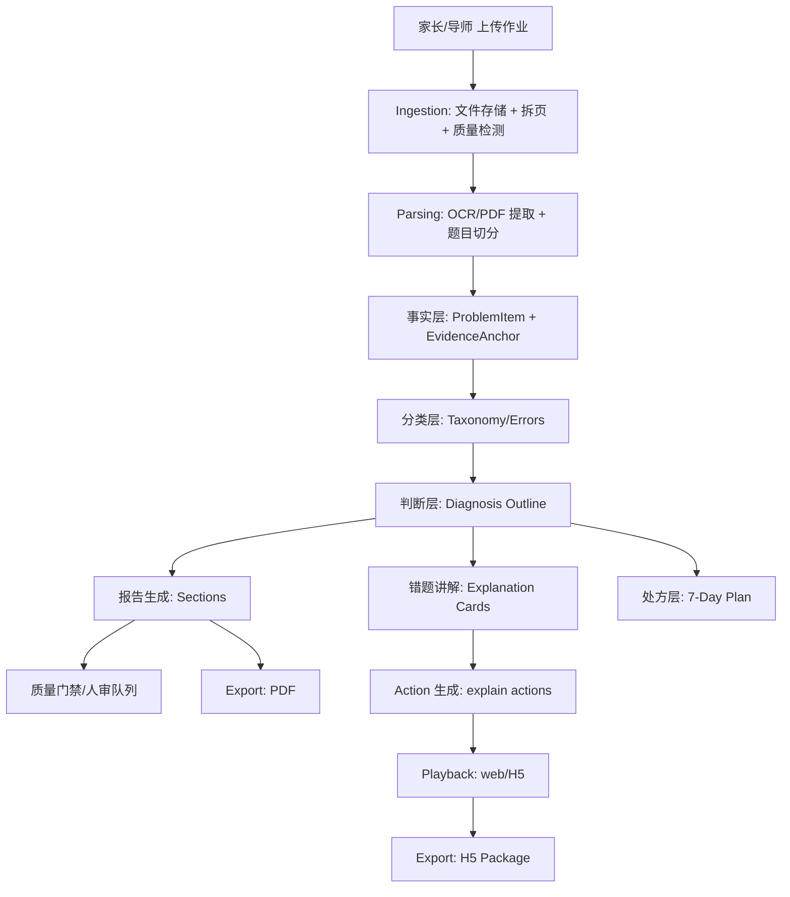
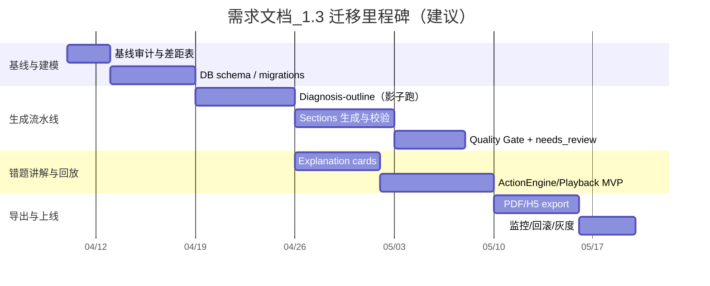

# 需求文档_1.3

> 文档名称：`需求文档_1.3.md`  
> 更新时间：2026-04-10（Asia/Jakarta）  
> 适用产品：Parent Dashboard / FamilyEducation（数学作业上传 → 学习诊断报告 / 错题讲解 / 7 天训练方案）  
> 参考开源：OpenMAIC（代码层面参考其“两段式生成 + 统一 Action/Playback + Provider 抽象”等工程设计）

## 执行摘要

本版本（1.3）的核心目标，是把你现有系统的“报告生成”升级为**可控、可校验、可回放、可导出**的生成系统，并把“学习诊断报告 / 错题讲解 / 7 天训练方案”三件事用**同一套生成流水线与数据模型**贯通起来。

OpenMAIC 的关键可借鉴点主要有四类：

其一，两段式生成流水线：先把用户需求与材料变成“场景大纲（outline）”，再把每个 outline 生成完整内容与动作序列；并包含 fallback（例如 outline 类型缺配置时降级）。这一设计显著降低“直接让大模型写完整内容”的漂移和不可控。citeturn2view0turn2view1turn5view0turn15view1

其二，统一 Action 模型与 Playback 引擎：OpenMAIC 把语音、白板、聚光灯、激光笔等都抽象为 Action，并由 ActionEngine 统一执行；PlaybackEngine 用状态机消费 Scene.actions，支持播放/暂停/恢复与讨论态。这个“**生成输出 = 可执行动作序列**”的抽象，特别适合迁移到“错题讲解”的可回放交互（H5/导师分享/带娃讲解）。citeturn3view0turn3view1turn3view3turn3view5

其三，Provider 配置与安全：OpenMAIC 采用“YAML（主）+ env（备）”加载多类 provider（LLM/TTS/ASR/PDF/Image/Video/WebSearch），并明确“keys never leave the server”；对用户提供的 baseUrl 做 SSRF guard，支持通过 `ALLOW_LOCAL_NETWORKS` 为私有部署放开。此模式可直接借鉴到你的 OCR/LLM/存储 provider 管理，提升上线安全性与可运维性。citeturn17view1turn12view0turn17view0turn13view0

其四，许可证风险（强约束）：OpenMAIC 在仓库与 package.json 中标注为 AGPL-3.0。若你将其代码（或派生代码）用于对外提供网络服务的闭源产品，会触发 AGPL 义务（通常需要向网络交互用户提供对应源代码）。因此，**默认策略应是“架构/思想借鉴 + 自研重写”，而非复制代码**；如确需复用，需进行合规评估或获取商业授权。citeturn0search0turn3view6turn0search6turn0search17

本需求文档在“本地代码路径未提供、无法直接审计源码”的前提下，给出：

- 一份可直接落地的 1.3 目标架构（模块边界、TS 类型、API 路由、DB schema、存储与 provider 抽象）
- 以 OpenMAIC 为参照的可复用设计清单（哪些可借鉴、怎样改名/重写、如何避免 AGPL 传染）
- “诊断大纲 → 分段生成 → 错题讲解卡片 → 7 天计划”的生成流水线规格（含 prompt 模板、JSON schema、校验规则与质量门禁）
- 带优先级、工作量（低/中/高）、测试用例与回滚标准的迁移计划（含 mermaid Gantt）

## 范围与约束

### 范围定义

1.3 覆盖三类核心输出，并要求三者共享底层“事实层（ProblemItem/Evidence）”：

- 学习诊断报告：Primary/Secondary/Pattern/Sporadic/Do-not-overreact + Evidence + Parent note（家长可理解）
- 错题讲解：按题目或按“错误模式”生成 Explanation Cards，并支持回放（Action-based）与导出（H5/PDF 内嵌卡片）
- 7 天训练方案：每日目标/时长/任务/家长提示/成功检查 + pauseList

### 关键约束

- 本会话无法直接读取你的本地项目源码（你未提供 repo path/挂载目录）。因此“现有代码审计”将以**待填空的审计模板**形式交付，并给出自动化审计脚本建议；文档中会提供“把审计结果粘贴到哪里”的占位符。
- 对 OpenMAIC 的引用以其公开仓库与关键源码文件为准。citeturn10search0turn2view0turn2view1turn3view1turn12view1
- 默认采取“仅借鉴设计，不复制代码”的合规策略，除非你明确要走 AGPL 开源或拿到商业授权。citeturn0search0turn0search6

## 现有实现审计

### 你需要补齐的“现状审计产物”

为满足 1.3 的“严谨映射”，工程上需要先产出一份机器可读的审计结果（建议 JSON + Markdown 两份）。本节给出**必须输出的清单**；执行后，把结果粘贴到“附录：现状审计结果（待粘贴）”。

审计产物必须包含：

- 模块树：`/app` 页面、`/app/api` 路由、`/lib` 核心逻辑、`/db` schema/migrations、`/providers`（如有）
- TS 类型与数据模型：核心 domain types（Child/Upload/Run/Report/Evidence/Plan/Share/AdminReview）
- API 契约：每个 route 的 request/response（含 async job）
- DB：表、字段、索引、外键；以及与“诊断流水线六步”对应的落表点
- 生成链路：从 upload 到 report 的实际函数调用图（至少到文件级）

### 推荐的自动化审计脚本

下面脚本不依赖你的业务语义，只做“结构与接口”抽取，适合 1 次跑完生成 baseline。

```ts
// scripts/audit-codebase.ts
// 用法：node --loader ts-node/esm scripts/audit-codebase.ts > audit.json
import fg from "fast-glob";
import fs from "node:fs";

type ApiRoute = { file: string; methodExports: string[] };
type Audit = {
  generatedAt: string;
  pages: string[];
  apiRoutes: ApiRoute[];
  schemas: string[];
};

function readExports(tsContent: string): string[] {
  const methods = ["GET", "POST", "PUT", "PATCH", "DELETE"];
  return methods.filter(m => new RegExp(`export\\s+async\\s+function\\s+${m}\\b`).test(tsContent));
}

async function main() {
  const pages = await fg(["app/**/page.tsx", "src/app/**/page.tsx"], { dot: false });
  const routeFiles = await fg(["app/api/**/route.ts", "src/app/api/**/route.ts"], { dot: false });
  const schemaFiles = await fg(["**/schema.ts", "**/schema/*.ts", "**/migrations/**"], { dot: true });

  const apiRoutes: ApiRoute[] = routeFiles.map(file => {
    const content = fs.readFileSync(file, "utf8");
    return { file, methodExports: readExports(content) };
  });

  const audit: Audit = {
    generatedAt: new Date().toISOString(),
    pages,
    apiRoutes,
    schemas: schemaFiles,
  };

  process.stdout.write(JSON.stringify(audit, null, 2));
}

main().catch(err => {
  console.error(err);
  process.exit(1);
});
```

工程验收标准：产出 `audit.json`（可 diff），并在 PR 中作为 artifacts 存档；任何新增 route/schema 都必须更新审计结果。

### 本版本对“现状”的关键差距假设

以下差距是假设（基于你现有文档对系统能力的描述），需要用上面的审计结果验证并替换为真实结论：

- 生成链路可能仍以“单次大模型生成整份报告 JSON”为主，缺少“分段生成 + 结构校验 + 质量门禁”导致漂移与不可回溯风险。
- 错题讲解可能是报告中的文字段落，而不是可复用的“卡片（card）+ 动作（action）”结构，导致无法回放/无法导出交互讲解。
- Evidence 在 UI 上可高亮，但后端未必有统一的 anchor 数据结构（例如 bbox/页码/题号/证据片段），导致“结论—证据”一致性难以全自动验证。
- provider 配置与安全策略（私有 baseUrl、SSRF）可能仍未体系化。

## OpenMAIC 组件解析与映射

### OpenMAIC 的可迁移抽象

OpenMAIC 的几个“足够通用”的抽象点，适配你的诊断产品：

- **两段式生成**：`UserRequirements → SceneOutline[] → Scene(content+actions)`。其中 `UserRequirements` 已被简化为单个 `requirement` 文本 + `language` + profile 字段，这种“输入极简 + 输出结构化”的路线更利于产品化（更少表单字段、更强 prompt 约束）。citeturn5view0turn2view0
- **大纲阶段的 fallback**：当 outline 声称 interactive/pbl 但缺关键配置时，降级为 slide，避免流水线崩溃。citeturn2view0turn2view1turn15view1
- **Scene 生成两步拆分**：先生成 content，再生成 actions，并且 server 侧有分 API 的 route（`scene-content` / `scene-actions`），方便并行与重试。citeturn15view1turn14view4
- **ActionEngine / PlaybackEngine**：统一 action 类型，播放引擎直接消费 actions，无需“compile step”；并通过状态机管理播放/暂停/讨论等模式。citeturn3view0turn3view1turn3view3
- **stateless server API**：Chat API 接收 `storeState`（stage/scenes/currentSceneId/mode）并 SSE streaming 返回事件；客户端通过 abort 控制中断，服务端以 heartbeat 防止连接超时。这个“服务端无会话、客户端带状态”的设计对你未来做“导师分享实时讲解 / 家长边看边问”很有价值。citeturn14view3turn3view2
- **ProviderConfig 与 SSRF guard**：YAML/env 双通道、key 不出服务端、可选允许本地网络；对用户提供 baseUrl 进行 SSRF 校验。citeturn17view1turn17view0turn12view0turn13view0
- **PDF 解析 provider 化**：`parsePDF(config, buffer)` 统一输出 `{ text, images, metadata }`，默认 unpdf，增强用 MinerU；并附带 imageMapping/pdfImages 元数据。citeturn12view1turn12view0
- **PPTX 导出**：在 export 中把 `speech` action 的文本汇入 speaker notes（对你生成“导师讲解稿”很像）。citeturn8view2

### 组件对照表

| 能力域 | 你现有系统（待审计补齐） | OpenMAIC 对应实现 | 迁移策略（建议） | 风险点 |
|---|---|---|---|---|
| 输入材料解析（PDF/图片） | `TODO: 粘贴模块/route` | `app/api/parse-pdf` + `lib/pdf/pdf-providers`（unpdf/MinerU）citeturn12view0turn12view1 | **借鉴 Provider 工厂模式并自研实现**；保留你既有 OCR/拆页链路 | SSRF、成本、解析质量；MinerU 授权与部署 |
| 生成流水线（两段式） | `TODO` | `outline-generator` + `scene-generator` + `generation-pipeline` barrelciteturn2view0turn2view1turn15view0 | 直接迁移“Outline→Section”的思路；输出改为“诊断大纲→报告分段→卡片→计划” | 不应复制代码（AGPL） |
| 动作模型（可回放） | `TODO` | `lib/types/action` + `ActionEngine` + `PlaybackEngine`citeturn3view3turn3view0turn3view1 | 复用“Action = UI side-effect”的抽象；缩减 action 集合到诊断场景 | 生成动作需强校验，否则容易跑飞 |
| 多智能体/对话编排 | `TODO` | `DirectorGraph`（LangGraph）+ `stateless chat SSE`citeturn3view2turn14view3 | 诊断主链路先用“确定性流水线”；分享/讲解再引入“轻量单 agent + action 输出” | 过早上多 agent 会放大不可控与成本 |
| 导出（PDF/H5/包） | `TODO`（你已有 PDF export） | `use-export-pptx`（PptxGenJS）、HTML export 相关实现citeturn8view2turn10search0 | 你的场景优先：PDF（家长）+ H5（分享/回放）；PPTX 可选 | H5 需要资源打包与离线策略 |

## 目标架构与数据契约

### 总体架构

目标架构把“报告/讲解/计划”统一为同一条“事实→分类→判断→处方→可回放呈现”的链路，并把“回放/导出”视为一等公民。



该架构借鉴了 OpenMAIC 的“outline→content→actions→playback”主干。citeturn2view0turn2view1turn3view1turn3view0

### 模块划分

建议以 `core/*` 分离 domain，与 `providers/*`、`app/api/*`、`ui/*` 解耦：

- `core/intake`：诊断输入（Diagnostic Intake）
- `core/problem-items`：题目切分、题干/作答/判错抽取
- `core/taxonomy`：错误分类与置信度
- `core/diagnosis`：聚合与结论结构（pattern/sporadic/doNotOverreact）
- `core/explanations`：错题讲解卡片与动作脚本
- `core/plans`：7 天计划规则库 + 生成
- `core/quality-gate`：质量评分/门禁/人审策略
- `core/actions`：Action 类型、ActionEngine、PlaybackEngine（你自研实现，但沿用 OpenMAIC 统一 action 的思想）
- `providers/llm`、`providers/ocr`、`providers/pdf`、`providers/tts`：可替换 provider
- `infra/storage`：对象存储（uploads、artifacts、exports）
- `infra/jobs`：队列/异步任务（runs）
- `infra/observability`：trace、成本、质量指标

### TypeScript 核心类型

以下类型体现 1.3 的“统一契约”；其中 Action 部分是借鉴 OpenMAIC 的模式（fire-and-forget vs synchronous 等），但字段可按你产品裁剪。citeturn3view0turn3view3turn3view1

```ts
// core/types/domain.ts
export type Locale = "en-US" | "es-ES" | "zh-CN";

export type TeacherMark = "correct" | "wrong" | "partial" | "unknown";

export interface EvidenceAnchor {
  // 指向“原始材料”的最小可定位单元
  pageId: string;
  pageNumber: number;      // 1-based
  bbox?: [number, number, number, number]; // [x1,y1,x2,y2] 归一化或像素
  problemNumber?: string;  // Q4 / #12 等
  snippet?: string;        // OCR 片段（可选）
  confidence: number;      // 0..1
}

export interface ProblemItem {
  id: string;
  childId: string;
  uploadId: string;
  anchors: EvidenceAnchor[];   // 至少 1 个
  questionSummary: string;     // 题型摘要
  studentResponseSummary: string;
  teacherMark: TeacherMark;
  topicHint?: string;          // fractions/equations/geometry/...
  workType?: "multiple_choice" | "computation" | "word_problem" | "open_response" | "mixed";
  confidence: number;
}

export type ErrorType =
  | "concept_gap"
  | "procedure_gap"
  | "calculation_slip"
  | "reading_issue"
  | "notation_error"
  | "strategy_error"
  | "careless_slip"
  | "incomplete_reasoning";

export interface ItemErrorLabel {
  id: string;
  problemItemId: string;
  errorType: ErrorType;
  severity: "low" | "medium" | "high";
  confidence: number;
  rationale: string; // 必填：引用 anchors/snippet 的解释，不许空话
  isPrimary: boolean;
}

export interface DiagnosisOutline {
  id: string;
  childId: string;
  runId: string;

  primary: { code: ErrorType; title: string; why: string; evidenceItemIds: string[] };
  secondary: Array<{ code: ErrorType; title: string; why: string; evidenceItemIds: string[] }>;

  patternIssues: Array<{ code: ErrorType; pattern: string; evidenceItemIds: string[] }>;
  sporadicIssues: Array<{ code: ErrorType; note: string; evidenceItemIds: string[] }>;

  doNotOverreact: Array<{ point: string; evidenceItemIds?: string[] }>;

  overallConfidence: number; // 0..1
  qualityGrade: "A" | "B" | "C" | "D";

  locale: Locale;
}

export interface ExplanationCard {
  id: string;
  childId: string;
  runId: string;
  title: string;             // “分数相加：通分步骤为什么不能跳”
  targetErrorType: ErrorType;
  anchors: EvidenceAnchor[]; // 必须能回到原材料
  explanation: {
    plain: string;           // 给家长/孩子看的文字
    steps: Array<{ step: string; why: string }>;
    commonPitfall: string;
    quickCheck: string;      // 30 秒检查题/口头检查
  };
  // 回放脚本（可选）
  actions?: Action[];
}

export interface PlanDay {
  dayIndex: 1 | 2 | 3 | 4 | 5 | 6 | 7;
  minutes: number;
  goal: string;
  tasks: string[];
  parentPrompt: string;
  successCheck: string;
}

export interface SevenDayPlan {
  id: string;
  childId: string;
  runId: string;
  focus: { primary: ErrorType; secondary?: ErrorType[] };
  days: PlanDay[];
  pauseList: string[];
  planVersion: string;
  locale: Locale;
}
```

### Action 与 Playback 的最小实现规格

OpenMAIC 的 Action 系统强调“统一 action 类型 + 执行引擎 + Playback 状态机”，并区分 fire-and-forget 与 synchronous。你的错题讲解只需一个子集（高亮/讲述/白板），但应保留同样的可回放契约。citeturn3view0turn3view3turn3view1turn3view5

```ts
// core/types/actions.ts
export interface ActionBase { id: string; title?: string; }

export type Action =
  | ({ type: "spotlight"; anchor: EvidenceAnchor; dimOpacity?: number } & ActionBase)
  | ({ type: "laser"; anchor: EvidenceAnchor; color?: string } & ActionBase)
  | ({ type: "speech"; text: string; audioUrl?: string; voice?: string; speed?: number } & ActionBase)
  | ({ type: "wb_open" } & ActionBase)
  | ({ type: "wb_draw_text"; content: string; x: number; y: number; width?: number; height?: number } & ActionBase)
  | ({ type: "wb_draw_latex"; latex: string; x: number; y: number; width?: number } & ActionBase)
  | ({ type: "wb_draw_line"; startX: number; startY: number; endX: number; endY: number } & ActionBase)
  | ({ type: "wb_clear" } & ActionBase)
  | ({ type: "wb_close" } & ActionBase);

export type PlaybackMode = "idle" | "playing" | "paused";

export interface PlaybackSnapshot {
  actionIndex: number;
  cardId: string;
}
```

实现要求：

- `ActionEngine.execute(action)`：必须幂等（同 actionId 重放不造成重复污染），并对缺失资源（audioUrl/anchor）优雅降级。
- `PlaybackEngine`：状态机至少支持 `start/pause/resume/stop/restoreFromSnapshot`，并能在用户交互时中断（类似 OpenMAIC 的 abort 思路）。citeturn14view3turn3view1

### API 路由建议

以 Next.js App Router 风格为例（你可映射到现有框架），关键在于“异步 run + 可重试阶段”。

```ts
// app/api/runs/route.ts
// POST: create run; GET: list
export interface CreateRunReq {
  childId: string;
  uploadId: string;
  locale: "en-US" | "es-ES";
  intake: {
    diagnosticGoal: "after_quiz_test" | "homework_keeps_failing" | "before_hiring_tutor" | "weekly_review" | "other";
    recentTrend?: "improving" | "stable" | "declining" | "not_sure";
    parentConcern?: string[];
    notes?: string;
  };
}
export interface CreateRunRes { runId: string; status: "queued" | "running" | "needs_review" | "done" | "failed"; }
```

推荐拆分的阶段路由（对应你 1.2.2 的六步流水线）：

- `POST /api/runs/:runId/extract-items`
- `POST /api/runs/:runId/label-taxonomy`
- `POST /api/runs/:runId/build-diagnosis-outline`
- `POST /api/runs/:runId/generate-explanations`
- `POST /api/runs/:runId/generate-plan`
- `POST /api/runs/:runId/quality-gate`
- `POST /api/runs/:runId/publish`（或自动 publish）

OpenMAIC 把 scene-content 与 scene-actions 拆成两个 endpoint，利于失败重试与并行；你这里也建议拆分，尤其是“错题卡片生成”和“行动脚本生成”分离。citeturn15view1turn14view4

### 数据库 Schema 建议

以 PostgreSQL 为例（你现有是 Neon/Vercel 部署链路时，这个选择常见），核心原则：**证据锚点必须落表**，否则无法做一致性校验与回放。

建议最小表集（字段省略为要点）：

- `children(id, parent_id, nickname, grade, locale_default, created_at, ...)`
- `uploads(id, child_id, status, original_file_key, intake_json, created_at, ...)`
- `upload_pages(id, upload_id, page_number, image_key, width, height, quality_json, ...)`
- `analysis_runs(id, child_id, upload_id, status, stage, retry_count, overall_confidence, quality_grade, created_at, ...)`
- `problem_items(id, run_id, page_ids_json, question_summary, student_response_summary, teacher_mark, confidence, ...)`
- `evidence_anchors(id, run_id, problem_item_id, page_id, bbox, snippet, confidence, ...)`
- `item_error_labels(id, run_id, problem_item_id, error_type, severity, confidence, rationale, is_primary, ...)`
- `diagnosis_outlines(id, run_id, json, overall_confidence, quality_grade, ...)`
- `explanation_cards(id, run_id, json, ...)`
- `explanation_actions(id, card_id, json_actions, ...)`（或并入 cards.json）
- `seven_day_plans(id, run_id, json, plan_version, ...)`
- `reports(id, run_id, parent_version_json, student_version_json, tutor_version_json, published_at, ...)`
- `share_tokens(id, report_id, token, scope, expires_at, ...)`
- `admin_reviews(id, run_id, status, reviewer_id, notes, ...)`

可选（生产化必需但可延后）：

- `provider_calls(id, run_id, provider, model, tokens_in, tokens_out, cost, latency_ms, payload_hash, created_at)`
- `audit_events(id, actor, action, entity, entity_id, metadata_json, created_at)`

## Prompt 与生成流水线设计

### 设计原则

1. **结构化输出优先**：每一步都输出 JSON（严格 schema），并在服务端 zod 校验；必要时做“JSON repair + 再校验”。
2. **证据约束**：任何 diagnosis / explanation / plan 的结论都必须引用 `problem_item_id` 或 `evidence_anchor_id`（至少一个）。
3. **分段生成**：先生成 DiagnosisOutline，再生成（报告段落、卡片、计划、动作脚本）；避免“一次生成全篇”。
4. **质量门禁**：A/B/C/D 级；低于门槛进入 needs_review 或发布“谨慎版”。

OpenMAIC 在 outline 阶段就把 userProfile、researchContext、teacherContext、mediaGenerationPolicy 等作为 prompt 变量注入，并在输出后做结构修复与 ID 规范化；你可以把这些做法迁移为：intake/profile/context 注入 + 输出修复 + 引用校验。citeturn2view0turn5view0

### Agent 角色划分

建议先“单 agent 多工具（分阶段）”，而非立即上“多 agent director”。原因是诊断链路更像 ETL+rule+LLM 的工程流水线，强确定性更重要；多 agent 适合“讲解互动/问答”。（OpenMAIC 的 director graph 更适合课堂对话轮转。citeturn3view2turn14view3）

角色建议：

- IntakeAnalyst：把 intake 与材料概览转为“本次诊断场景摘要”
- ItemExtractor：抽取 ProblemItem 与 anchors（必要时用视觉/OCR）
- TaxonomyLabeler：产出 ItemErrorLabel（必须 rationale）
- Diagnostician：聚合 DiagnosisOutline（包含 pattern/sporadic/doNotOverreact）
- Explainer：生成 ExplanationCard（每卡必须 anchors）
- Planner：生成 SevenDayPlan（规则库 + LLM 表达）
- ActionScripter：为卡片生成 Action[]（可选；先只给 Top-3 卡片）
- QualityGate：评分与门禁

### Prompt 模板示例

下面示例采用“强约束 JSON 输出”，并把 anchors 作为可引用列表提供给模型；模型只能在 `allowedAnchorIds` 范围内引用。

#### Diagnosis outline prompt（示例）

```text
System:
你是资深数学学习诊断师。你的任务是：根据结构化题目事实（problem_items）与错误标签（item_error_labels）生成诊断大纲（DiagnosisOutline）。
必须仅输出 JSON，不要输出 Markdown、解释文字或多余字符。

硬约束：
- primary/secondary/pattern/sporadic/doNotOverreact 每条都要写清“为什么”。
- 任何结论必须引用 evidenceItemIds（problem_item_id 列表）；pattern/sporadic 也必须引用。
- overallConfidence 必须在 0~1。
- qualityGrade 只能是 A/B/C/D。

User:
locale: en-US
allowedProblemItemIds: ["pi_1","pi_2","pi_3",...]
problem_items: [...]
item_error_labels: [...]
intake_summary: "after_quiz_test; parentConcern=steps,carelessness; teacherFeedbackPresent=true"
输出 JSON，符合以下 schema：
{ ...JSON Schema 省略... }
```

#### Explanation card + actions prompt（示例）

生成卡片内容与动作脚本分两步（建议），原因：动作脚本更容易跑飞，需要更强的“可执行性校验”。

- Step A：ExplanationCard（纯内容 + anchors）
- Step B：Action[]（仅从允许 action 集合中选择）

OpenMAIC 通过 `getActionDescriptions()` 把动作描述注入系统 prompt，并按 scene 类型过滤允许动作；你可以对“讲解卡片”同样做“allowedActions + text descriptions”。citeturn3view5turn15view1

### JSON Schema 与校验规则

每个阶段都需要两层校验：

- **Schema 校验**（zod / jsonschema）：字段类型、枚举、必填
- **一致性校验**（自定义）：引用存在、证据数量足够、置信度与等级匹配

示例：ExplanationCard 一致性校验（伪代码）

```ts
function validateCard(card: ExplanationCard, anchorIndex: Map<string, EvidenceAnchor>) {
  if (!card.anchors.length) throw new Error("ExplanationCard must include anchors");
  for (const a of card.anchors) {
    if (!a.pageId || a.confidence == null) throw new Error("invalid anchor");
  }
  if (card.actions) {
    // Action 引用 anchor 必须来自 card.anchors
    const allowedPageIds = new Set(card.anchors.map(a => a.pageId));
    for (const act of card.actions) {
      if ((act.type === "spotlight" || act.type === "laser") && !allowedPageIds.has(act.anchor.pageId)) {
        throw new Error("action anchor out of scope");
      }
    }
  }
}
```

### 生成流水线变更

将你 1.2.2 的“六步诊断流水线”固化为 1.3 的 pipeline DAG（允许部分并行）：

- Diagnostic Intake → 作为所有 prompt 的“场景条件”
- ProblemItem → 事实层（后续必依赖）
- Taxonomy → 分类层（diagnosis 与 plan 的输入）
- DiagnosisOutline → “诊断大纲”（替代直接写报告）
- Section Generators：
  - Report Sections（家长/学生/导师三版本）
  - Explanation Cards（按“Top patterns + Top wrong items”）
  - SevenDayPlan（规则库拼装 + LLM wording）
- Quality Gate → A/B 发布策略；C/D needs_review

OpenMAIC 的 `generateSceneOutlinesFromRequirements()` 在 stage 1 内同时考虑 pdfText、pdfImages、visionImages，并对输入长度与图片数量进行截断控制（MAX_* 常量）；你在 diagnosis-outline 阶段也需要类似的“上下文预算器”（文本截断、图片采样、仅保留 Top anchors）。citeturn2view0turn12view1turn13view0

## 迁移计划、里程碑与验收

### 工作项清单与工作量评估

| Milestone | 交付物 | 关键任务 | 工作量 |
|---|---|---|---|
| 基线审计完成 | `audit.json` + “现状-目标差距表” | 跑审计脚本；梳理现有 DB/route；贴入本文件附录 | 低 |
| 数据模型升级 | 新表与迁移脚本 | `problem_items/evidence_anchors/item_error_labels/diagnosis_outlines/explanation_cards/seven_day_plans` 落表；补索引 | 中 |
| 两段式生成上线（影子模式） | 新 pipeline 在后台跑，不影响用户展示 | 实现 `diagnosis-outline` + `section generators`；zod 校验 + JSON repair；落表 | 高 |
| 错题讲解卡片 + 回放 MVP | H5 内可播放 Top-3 卡片讲解 | Action 类型子集 + ActionEngine + PlaybackEngine；卡片生成与动作脚本生成 | 高 |
| 质量门禁 + 人审工作流 | A/B/C/D 规则可控 | Quality score；needs_review 队列；报告谨慎版模板 | 中 |
| 导出优化（PDF/H5） | PDF 版报告 + H5 分享页 | PDF：静态报告+卡片；H5：可播放 embed JSON + assets | 中 |
| 监控与回滚机制 | 可观测、可降级 | provider_calls 成本日志；feature flags；回滚开关 | 中 |

### Timeline（mermaid Gantt）



### 测试用例

必须覆盖“结构正确、引用正确、可回放、可导出、可降级”五类。

- 解析层
  - PDF 有文本/无文本（扫描件）；图片旋转/模糊；多页
  - anchors 坐标合法（0..1 或像素范围），且能在前端正确高亮
- 事实层（ProblemItem）
  - 每个 ProblemItem 至少 1 anchor；teacherMark 缺失时为 unknown
- 分类层（Taxonomy）
  - 每题最多 2 个标签；rationale 非空；置信度在 0..1
- 判断层（DiagnosisOutline）
  - primary 必有；pattern/sporadic 分类符合规则（至少可解释）
  - 每条诊断引用的 problem_item_id 必存在
- 处方层（SevenDayPlan）
  - 7 天齐全；minutes 合理（例如 10~45）；pauseList 非空
- 错题讲解（ExplanationCard + Actions）
  - 卡片 anchors 不空；action 引用 anchor 在范围内
  - Playback：start/pause/resume/stop/snapshot/restore 覆盖
- 导出
  - PDF：报告结构完整；卡片可读；证据引用可追溯（页码/题号/截图）
  - H5：离线打开（至少在同域缓存 asset 或打包 zip）

OpenMAIC 在 chat SSE 中加入 heartbeat，避免代理/浏览器断开；如果你做 H5 分享页的“实时讲解/边看边问”，也应在 SSE 层做类似心跳与 abort 中断。citeturn14view3

### 回滚标准

必须具备“一键降级回旧链路”的能力（feature flag），并定义触发阈值：

- 成本：单位 run 平均成本超过旧链路 2 倍且连续 24h
- 失败率：`run.status=failed` 或 `needs_review` 超过 30% 且连续 6h
- 一致性错误：引用不存在（anchor/page 缺失）> 1%（硬错误）
- 用户体验：生成时长 P95 超过 2 倍且无可接受降级策略

### CI / Deploy 建议

对齐 OpenMAIC 的工程实践：单测（vitest）+ e2e（playwright），并在 PR 阶段跑 schema 与 prompt contract tests。citeturn3view6turn10search0

最低 CI 流程建议：

- `lint`（eslint/prettier）
- `typecheck`（tsc）
- `test:unit`（vitest）
- `test:e2e`（playwright：上传→生成→查看→导出→分享）
- `db:migrate:check`（迁移可重放）
- `contracts:prompts`（对固定输入跑 prompt，校验 JSON schema + 一致性规则）

## 合规与许可证说明

OpenMAIC 仓库与其 package.json 标注许可为 AGPL-3.0。citeturn0search0turn3view6turn10search0

AGPL 的核心特征是面向网络服务的强 copyleft：用于网络交互的软件，若你修改并对外提供服务，通常需要向与其交互的用户提供对应源代码（GNU 官方对 AGPL 的定位亦强调其针对网络服务器场景的“协作/开放”目的）。citeturn0search6turn0search0

因此 1.3 的默认合规策略是：

- 仅借鉴其架构思想（两段式生成、统一 action、provider 抽象、SSRF guard），**自行实现代码**
- 不复制其源文件、不做“改名粘贴”、不引入其关键实现片段
- 如确需复用 OpenMAIC 代码：必须评估你产品是否愿意在 AGPL 下开源对应部分，或与权利方沟通商业授权（OpenMAIC 生态中也明确提到 AGPL 与商业授权并存的可能性）。citeturn0search3turn0search0

在大型商业组织里，AGPL 常被视为高风险依赖（例如某些公司直接禁止使用），这也提示你：如果你要做商业化闭源 SaaS，“复制代码”不是默认选项。citeturn0search17